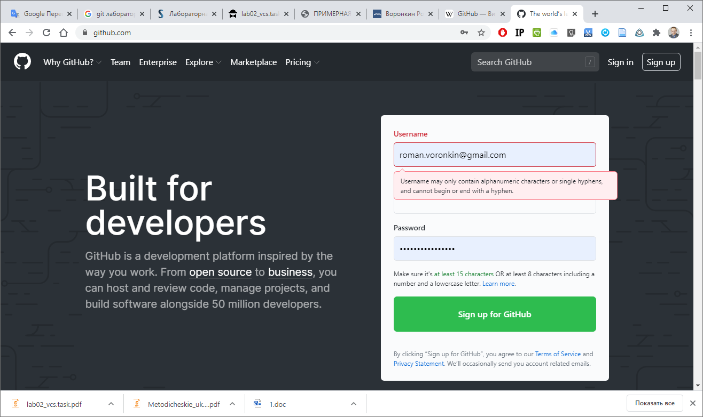
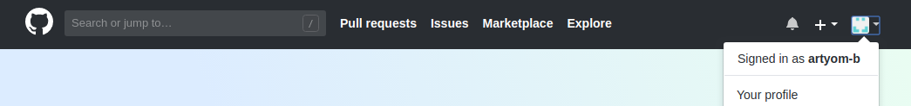
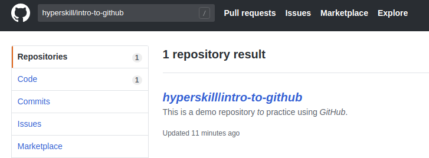
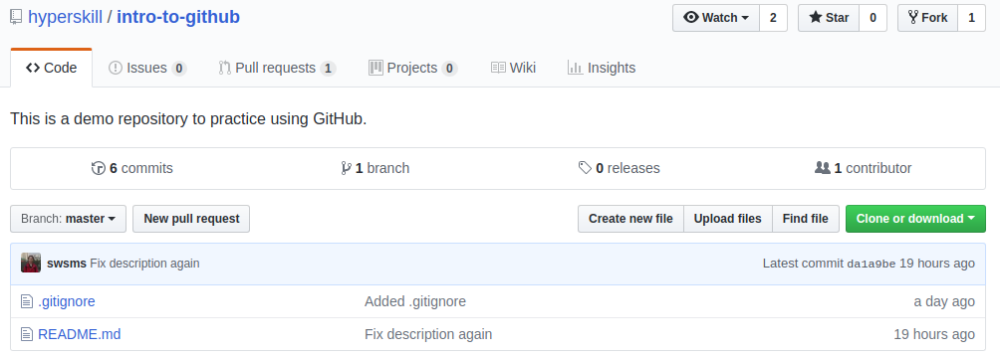
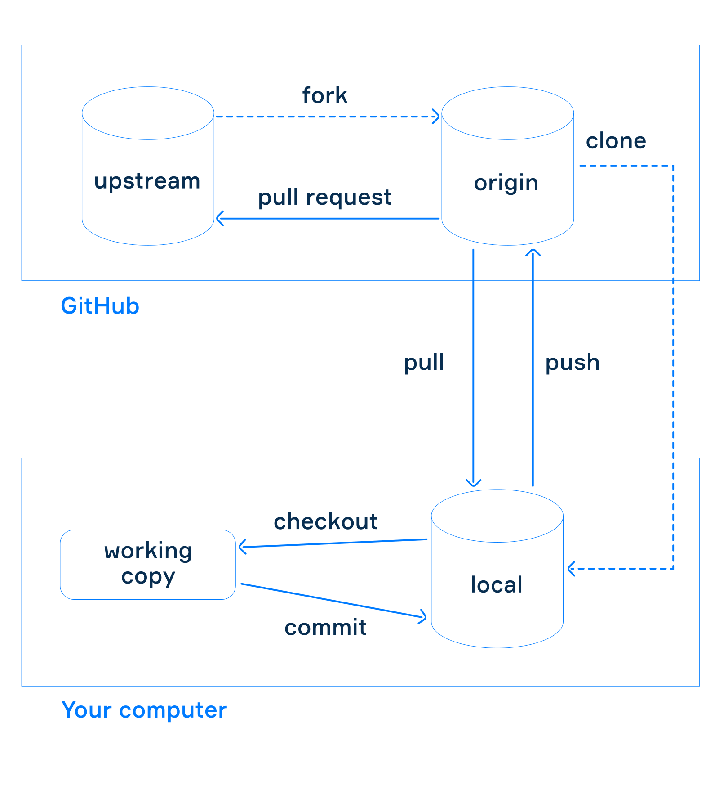
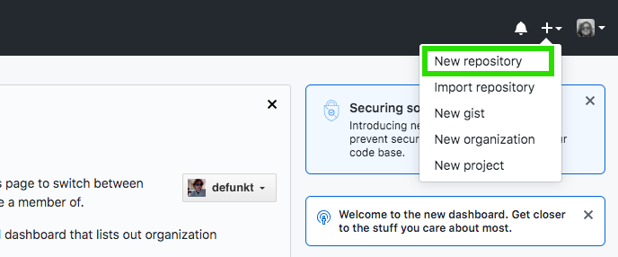
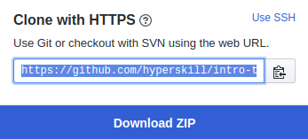

# Лабораторная работа 2.1 Исследование основных возможностей Git и GitHub

**Цель работы:** *исследовать базовые возможности системы контроля версий Git и веб-сервиса для хостинга IT-проектов GitHub.*

## Теоретические сведения

### Системы контроля версий

Что такое контроль версий, и зачем он вам нужен? **Система контроля версий** (СКВ) — это система, регистрирующая изменения в одном или нескольких файлах с тем, чтобы в дальнейшем была возможность вернуться к определённым старым версиям этих файлов. Программисты обычно помещают в систему контроля версий исходные коды программ, но на самом деле под версионный контроль можно поместить файлы практически любого типа.

Если вы графический или веб­дизайнер и хотели бы хранить каждую версию изображения или макета, то пользоваться системой контроля версий будет очень мудрым решением. СКВ даёт возможность возвращать отдельные файлы к прежнему виду, возвращать к прежнему состоянию весь проект, просматривать происходящие со временем изменения, определять, кто последним вносил изменения во внезапно переставший работать модуль, кто и когда внёс в код какую-то ошибку, и многое другое. Вообще, если, пользуясь СКВ, вы всё испортите или потеряете файлы, всё можно будет легко восстановить. Вдобавок, накладные расходы будут очень маленькими.

#### Локальные системы контроля версий

Многие люди в качестве метода контроля версий применяют копирование файлов в отдельную директорию (возможно даже, директорию с отметкой по времени, если они достаточно сообразительны). Данный подход очень распространён из-за его простоты, однако он невероятно сильно подвержен появлению ошибок. Можно легко забыть, в какой директории вы находитесь, и случайно изменить не тот файл или скопировать не те файлы, которые вы хотели.

Для того, чтобы решить эту проблему, программисты давным-давно разработали локальные СКВ с простой базой данных, которая хранит записи о всех изменениях в файлах, осуществляя тем самым контроль ревизий (рис. 1.1).


<center><i>Рисунок 1.1 -- Локальный контроль версий</i></center>

Одной из популярных СКВ была система RCS, которая и сегодня распространяется со многими компьютерами. RCS хранит на диске наборы патчей (различий между файлами) в специальном формате, применяя которые она может воссоздавать состояние каждого файла в заданный момент времени.

#### Централизованные системы контроля версий

Следующая серьёзная проблема, с которой сталкиваются люди, — это необходимость взаимодействовать с другими разработчиками. Для того, чтобы разобраться с ней, были разработаны централизованные системы контроля версий (ЦСКВ). Такие системы, как CVS, Subversion и Perforce, используют единственный сервер, содержащий все версии файлов, и некоторое количество клиентов, которые получают файлы из этого централизованного хранилища. Применение ЦСКВ являлось стандартом на протяжении многих лет (рис. 1.2).


<center><i>Рисунок 1.2 -- Централизованный контроль версий</i></center>

Такой подход имеет множество преимуществ, особенно перед локальными СКВ. Например, все разработчики проекта в определённой степени знают, чем занимается каждый из них. Администраторы имеют полный контроль над тем, кто и что может делать, и гораздо проще администрировать ЦСКВ, чем оперировать локальными базами данных на каждом клиенте.

Несмотря на это, данный подход тоже имеет серьёзные минусы. Самый очевидный минус — это единая точка отказа, представленная централизованным сервером. Если этот сервер выйдет из строя на час, то в течение этого времени никто не сможет использовать контроль версий для сохранения изменений, над которыми работает, а также никто не сможет обмениваться этими изменениями с другими разработчиками. Если жёсткий диск, на котором хранится центральная БД, повреждён, а своевременные бэкапы отсутствуют, вы потеряете всё — всю историю проекта, не считая единичных снимков репозитория, которые сохранились на локальных машинах разработчиков. Локальные СКВ страдают от той же самой проблемы: когда вся история проекта хранится в одном месте, вы рискуете потерять всё.

#### Распределённые системы контроля версий

Здесь в игру вступают распределённые системы контроля версий (РСКВ). В РСКВ (таких как Git, Mercurial, Bazaar или Darcs) клиенты не просто скачивают снимок всех файлов (состояние файлов на определённый момент времени) — они полностью копируют репозиторий. В этом случае, если один из серверов, через который разработчики обменивались данными, умрёт, любой клиентский репозиторий может быть скопирован на другой сервер для продолжения работы. Каждая копия репозитория является полным бэкапом всех данных (рис. 1.3).


<center><i>Рисунок 1.3 -- Распределённый контроль версий</i></center>

Более того, многие РСКВ могут одновременно взаимодействовать с несколькими удалёнными репозиториями, благодаря этому вы можете работать с различными группами людей, применяя различные подходы единовременно в рамках одного проекта. Это позволяет применять сразу несколько подходов в разработке, например, иерархические модели, что совершенно невозможно в централизованных системах.

### Основы Git

Основное отличие Git от любой другой СКВ (включая Subversion и её собратьев) — это подход к работе со своими данными. Концептуально, большинство других систем хранят информацию в виде списка изменений в файлах. Эти системы (CVS, Subversion, Perforce, Bazaar и т. д.) представляют хранимую информацию в виде набора файлов и изменений, сделанных в каждом файле, по времени (обычно это называют контролем версий, *основанным на различиях*)(рис. 1.4).


<center><i>Рисунок 1.4 -- Хранение данных как набора изменений относительно первоначальной версии каждого из файлов</i></center>

Git не хранит и не обрабатывает данные таким способом. Вместо этого, подход Git к хранению данных больше похож на набор снимков миниатюрной файловой системы. Каждый раз, когда вы делаете коммит, то есть сохраняете состояние своего проекта в Git, система запоминает, как выглядит каждый файл в этот момент, и сохраняет ссылку на этот снимок. Для увеличения эффективности, если файлы не были изменены, Git не запоминает эти файлы вновь, а только создаёт ссылку на предыдущую версию идентичного файла, который уже сохранён. Git представляет свои данные как, скажем, **поток снимков** (рис. 1.5).


<center><i>Рисунок 1.5 -- Хранение данных как снимков проекта во времени</i></center>

Это очень важное отличие между Git и почти любой другой СКВ. Git переосмысливает практически все аспекты контроля версий, которые были скопированы из предыдущего поколения большинством других систем. Это делает Git больше похожим на миниатюрную файловую систему с удивительно мощными утилитами, надстроенными над ней, нежели просто на СКВ.

#### Целостность Git

В Git для всего вычисляется хеш-сумма, и только потом происходит сохранение. В дальнейшем обращение к сохранённым объектам происходит по этой хеш-сумме. Это значит, что невозможно изменить содержимое файла или директории так, чтобы Git не узнал об этом. Данная функциональность встроена в Git на низком уровне и является неотъемлемой частью его философии. Вы не потеряете информацию во время её передачи и не получите повреждённый файл без ведома Git.

Механизм, которым пользуется Git при вычислении хеш-сумм, называется SHA-1 хеш. Это строка длинной в 40 шестнадцатеричных символов (0-9 и a-f), она вычисляется на основе содержимого файла или структуры каталога. SHA-1 хеш выглядит примерно так:

```
24b9da6552252987aa493b52f8696cd6d3b00373
```

Вы будете постоянно встречать хеши в Git, потому что он использует их повсеместно. На самом деле, Git сохраняет все объекты в свою базу данных не по имени, а по хеш-сумме содержимого объекта.

#### Git обычно только добавляет данные

Когда вы производите какие-либо действия в Git, практически все из них только *добавляют* новые данные в базу Git. Очень сложно заставить систему удалить данные либо сделать что-то, что нельзя впоследствии отменить. Как и в любой другой СКВ, вы можете потерять или испортить свои изменения, пока они не зафиксированы, но после того, как вы зафиксируете снимок в Git, будет очень сложно что-либо потерять, особенно, если вы регулярно синхронизируете свою базу с другим репозиторием.

Всё это превращает использование Git в одно удовольствие, потому что мы знаем, что можем экспериментировать, не боясь серьёзных проблем. 

#### Три состояния

У Git есть три основных состояния, в которых могут находиться ваши файлы: *зафиксированное* (committed), *изменённое* (modified) и *подготовленное* (staged).

- Зафиксированный значит, что файл уже сохранён в вашей локальной базе.
- К изменённым относятся файлы, которые поменялись, но ещё не были зафиксированы.
- Подготовленные файлы — это изменённые файлы, отмеченные для включения в следующий коммит.

Мы подошли к трём основным секциям проекта Git: Git-директория (Git directory), рабочая директория (working directory) и область подготовленных файлов (staging area)(рис. 1.6).


<center><i>Рисунок 1.6 -- Рабочая директория, область подготовленных файлов и директория Git</i></center>

Git-директория — это то место, где Git хранит метаданные и базу объектов вашего проекта. Это самая важная часть Git, и это та часть, которая копируется при клонировании репозитория с другого компьютера.

Рабочая директория является снимком версии проекта. Файлы распаковываются из сжатой базы данных в Git-директории и располагаются на диске, для того чтобы их можно было изменять и использовать.

Область подготовленных файлов — это файл, обычно располагающийся в вашей Git-директории, в нём содержится информация о том, какие изменения попадут в следующий коммит. Эту область ещё называют “индекс”, однако называть её stage-область также общепринято.

Базовый подход в работе с Git выглядит так:

1. Вы изменяете файлы в вашей рабочей директории.
2. Вы выборочно добавляете в индекс только те изменения, которые должны попасть в следующий коммит, добавляя тем самым снимки *только* этих изменений в область подготовленных файлов.
3. Когда вы делаете коммит, используются файлы из индекса как есть, и этот снимок сохраняется в вашу Git-директорию.

Если определённая версия файла есть в Git-директории, эта версия считается *зафиксированной*. Если версия файла изменена и добавлена в индекс, значит, она *подготовлена*. И если файл был изменён с момента последнего распаковывания из репозитория, но не был добавлен в индекс, он считается *изменённым*.

### Начало работы с GitHub

GitHub - это платформа для размещения кода. Иными словами, это место, где разработчики могут хранить свои проекты и работать вместе. Таким образом контролировать версии программ и сотрудничать становится гораздо проще. GitHub основан на популярной системе управления версиями под названием Git и предоставляет некоторые дополнительные функции, такие как веб-интерфейс, инструменты совместной работы, средство отслеживания ошибок, статистика проекта и многое другое.

К 2018 году GitHub стал крупнейшим в мире источником исходного кода. Вы можете найти множество популярных проектов с открытым исходным кодом, размещенных на GitHub, и внести в них свой вклад.

#### Создание аккаунта на GitHub

Создание аккаунта на GitHub ничем не отличается от создания аккаунтов на других сервисах подобного рода. После перехода по URL https://github.com откроется главная страница сервиса (рис. 1.7), на которой необходимо перейти по ссылке "Sing up" для регистрации нового пользователя или "Sing in" в случае, если у Вас уже есть аккаунт GitHub.


<center><i>Рисунок 1.7 -- Вид главной страницы сервиса GitHub</i></center>

При регистрации выберите персональный план, не требующий оплаты. После регистрации откроется страница со списком репозиториев, в верхней части которой вы найдете окно поиска и информацию о вашем профиле (рис. 1.8). Профиль - это ваша публичная страница на GitHub, как и в социальных сетях. Когда вы ищете работу в качестве программиста, работодатели могут посмотреть ваш профиль GitHub и принять его во внимание, когда будут решать, брать вас на работу или нет. 


<center><i>Рисунок 1.8 -- Информация о профиле пользователя</i></center>

Вы можете открыть свой **профиль** и внести изменения (например, вы можете добавить биографию или установить изображение).

#### Изучение репозитория

GitHub содержит миллионы проектов, написанных на разных языках программирования.

Каждый проект размещается в своем собственном контейнере, который называется репозиторием. В нем можно хранить код, конфигурации, наборы данных, изображения и другие файлы, включенные в ваш проект. Любые изменения файлов в репозитории будут отслеживаться с помощью контроля версий.

Если вы хотите найти какой-то конкретный репозиторий проекта, введите его имя или часть имени в поле поиска. Вы увидите список подходящих репозиториев (рис. 1.9).


<center><i>Рисунок 1.9 -- Информация о репозитории</i></center>

Иногда имя хранилища может быть слишком длинным или может быть много хранилищ с одинаковым именем. Например, попробуйте выполнить поиск **intro-to-github** без **hyperskill/**.

Обычно у вас есть ссылка на репозиторий. Многие проекты с открытым исходным кодом публикуют ссылки на своих личных вебсайтах, или ваши коллеги могут дать вам ссылку на хранилище вашего проекта.

Примерная структура репозитория показана на рис. 1.10.


<center><i>Рисунок 1.10 -- Примерная структура репозитория</i></center>

Во вкладке Code находятся два файла. **README.md** - это файл, который описывает проект; каждый репозиторий должен включать этот файл. GitHub находит его и отображает его содержимое под репозиторием.

Другой файл – **.gitignore** –  указывает, какие файлы и каталоги Git следует игнорировать (например, в вашем проекте используется 3 гигабайта фотографий котят, а вы хотите опубликовать только исходный код проекта без картинок)

Хотя этот репозиторий является общедоступным, вы не можете изменять файлы в нем напрямую, поскольку у вас есть доступ только для чтения. Чтобы изменить файлы, вы должны быть **соавтором** проекта.

Вы можете **сделать коммит** или создать **пулл-реквест (Pull-request, PR)**, чтобы внести свой вклад в проект, даже если вы не являетесь соавтором, в этом случае авторы проекта рассмотрят его и могут принять или отклонить. 

Вкладка **Pull requests** содержит **пулл-реквесты** – предложения об изменениях в файлах, находящихся в репозитории (добавление, удаление или изменение файлов). Его владельцы могут рассмотреть запрос и внести ваши изменения, если сочтут их уместными.

В нашем проекте вкладка **Wiki** пуста, но на самом деле это место для документации по проекту (как его использовать, как он был разработан, его основные принципы и т. д.). В то время как **README.md** предназначен для быстрого информирования читателей о том, что может сделать ваш проект, Wiki помогают предоставить дополнительную документацию.

На вкладке **Insight** вы можете найти статистику и информацию о данном репозитории. Вы также можете посмотреть на Коммит(ы), которые представляют изменения в содержании репозитория.

### Локальная работа

Представьте, у вас есть репозиторий, размещенный на GitHub с проектом, который вы собираетесь развивать. Это может быть разветвленный репозиторий или оригинальный, суть в том, что у вас есть полный доступ к нему.

Стандартный подход к работе с проектом состоит в том, чтобы иметь локальную копию репозитория и фиксировать ваши изменения в этой копии, а не в удаленном репозитории, размещенном на GitHub. Этот локальный репозиторий имеет полную историю версий проекта, которая может быть полезна при разработке без подключения к интернету. После того, как вы что-то изменили в локальном, вы можете отправить свои изменения в удаленный репозиторий, чтобы сделать их видимыми для других разработчиков.

На рис. 1.11 ниже показана модель работы с GitHub.


<center><i>Рисунок 1.11 -- Модель работы с GitHub</i></center>

На этом рисунке показаны две отдельные области: **GitHub** и **ваш компьютер**.

Сначала рассмотрим область GitHub. В нем есть два хранилища:

- **upstream** - это оригинальный репозиторий проекта, который вы скопировали,
- **origin** - ваш fork (копия) на GitHub, к которому у вас есть полный доступ.

Чтобы перенести изменения с вашей копии в исходному репозиторий проекта, вам нужно сделать запрос на извлечение.

Если вы хотите внести небольшие изменения в свою копию (fork), вы можете использовать веб-интерфейс GitHub. Однако такой подход не удобен при разработке программ, поскольку вам часто приходится запускать и отлаживать их локально. Стандартный способ - создать локальный клон удаленного репозитория и работать с ним локально, периодически внося изменения в удаленный репозиторий.

### Установка Git

Для выполнения лабораторной работы необходимо установить Git локально. Для этого необходимо перейти на официальный сайт Git https://git-scm.com/ и скачать версию для Вашей операционной системы. После чего необходимо выполнить установку на свой компьютер. Некоторые дистрибутивы Linux, а также Mac OS поставляются с предустановленным Git.

Чтобы убедиться, что Git был успешно установлен, введите команду ниже в терминале, чтобы отобразить текущую версию вашего Git:

```shell
git version
```

Если она сработала, давайте добавим в настройки Git ваше имя, фамилию и адрес электронной почты, связанный с вашей учетной записью GitHub:

```shell
git config --global user.name <YOUR_NAME>
git config --global user.email <EMAIL>
```

### Создания репозитория GitHub

В правом верхнем углу, рядом с аватаром есть кнопка c плюсиком, нажимая которую мы переходим к созданию нового репозитория (рис 1.12).



<center><i>Рисунок 1.12 -- Начало создания репозитория</i></center>

В результате будет выполнен переход на страницу создания репозитория. Наиболее важными на ней являются следующие поля:

- **Имя репозитория**. Оно может быть любое, необязательно уникальное во всем github, потому что привязано к вашему аккаунту, но уникальное в рамках тех репозиториев, которые вы создавали.
- **Описание (Description)**. Можно оставить пустым.
- **Public/private**. Выбираем открытый (Public), **НЕ** ставим галочку “Initialize this repository with a README” ( В README потом будет лежать какая-то основная информация, что же такое ваш проект и как с ним работать).
- **.gitignore** и **LICENSE** можно сейчас не выбирать.

После заполнения этих полей нажимаем кнопку **Create repository**. Отлично, ваш репозиторий готов!

### Клонирование репозитория

После создания репозитория его необходимо клонировать на ваш компьютер. Для этого на странице репозитория необходимо найти кнопку  **Clone**  или **Code**  и щелкнуть по ней, чтобы отобразить адрес репозитория для клонирования (рис. 1.13).


<center><i>Рисунок 1.13 -- Получение адреса репозитория</i></center>

Откройте командную строку или терминал и перейдите в каталог, куда вы хотите скопировать хранилище. Затем напишите `git clone` и введите адрес:

```shell
git clone https://github.com/kushedow/flask-html
```

Теперь у вас есть локальное хранилище проекта.

_Обратите внимание, что вы можете переключиться на использование протокола SSL вместо HTTPS для клонирования репозитория. Мы не будем рассматривать это здесь, но вы можете узнать, как это сделать, если вам интересно (например, разработчики часто предпочитают SSL на практике)_.

### Локальное изменение содержимого

Теперь, когда репозиторий скопирован на ваш компьютер, вы хотите отредактировать его, а потом предложить нам свою версию верстки проектов (например, с анимированными кнопочками или такую, где на фоне идет снег – и вы можете это сделать!)

Перейдите в каталог хранилища и посмотрите на содержимое. Локальный репозиторий включает в себя все те же файлы, ветки и историю коммитов, как и удаленный репозиторий. Введите эту команду, чтобы проверить состояние вашего репозитория:

```shell
git status
```

Теперь ваша рабочая копия находится в главной ветке вашего локального репозитория. И она идентична оригинальной главной ветке.

```shell
On branch master
Your branch is up-to-date with 'origin/master'.
```

Основной рабочий процесс выглядит примерно так:

- Вы изменяете файлы в вашей рабочей копии.
- Вы выборочно вносите изменения, которые хотите включить в свой следующий коммит.
- Вы выполняете коммит, который включает ваши изменения.

Давайте внесем некоторые изменения. Откройте файл README.md и внесите их в него. После этого проверьте статус репозитория снова, и вы увидите, что файл был изменен.

```shell
modified:   README.md
```

Теперь внесите эти изменения, используя add:

```shell
git add README.md
```

Можно добавить сразу все измененные файлы в версионный контроль посредством команды:

```shell
git add .
```

Вы можете зафиксировать эти изменения в вашем локальном репозитории с описательным комментарием:

```shell
git commit -m "Add information about local repository in readme file"
```

Вы можете сделать столько коммитов, сколько вам нужно. Изменения могут быть разными: добавление новых файлов, удаление и изменение существующих. Не забывайте вносить их, используя add перед выполнением коммита.

### Pull & Push

Важно, что коммит добавляет изменения только в ваш локальный репозиторий. Если вы хотите распространить их в исходный репозиторий на GitHub, вам нужно использовать **push**.

В первый раз вам также необходимо отправить свою локальную ветку, потому что она не существует в удаленном репозитории.

```shell
git push --set-upstream origin edit-readme
```

В следующий раз сделать

```shell
git push
```

Чтобы внести изменения, сделанные кем-то другим, используйте **pull**:

```shell
git pull
```

Полезная вещь, которую следует сделать, - периодически выполнять pull, особенно перед push, чтобы предотвратить возможные конфликты, когда кто-то еще изменил файлы в хранилище в той же ветке. Прямо сейчас мы не будем рассказывать подробно о возможных конфликтах и о том, как их предотвращать. Но обязательно расскажем об этом в темах, связанных с командной разработкой.

После внесения изменений в вашу ветку вы можете найти ее на GitHub и создать Pull Request для исходного репозитория (upstream), как мы делали это раньше.

Есть еще одна проблема, которую мы еще не рассмотрели: кто-то может изменить исходный репозиторий, пока вы работаете в своей ветке, и вам нужно синхронизировать свои локальные и удаленные репозитории с этими изменениями. Мы также подробнее рассмотрим эту проблему в других темах.

### Оформление репозитория

Чтобы работать в команде и не сильно портить жизнь другим разработчикам, полезно знать простые правила публикации вашего кода в Github:

- Не отправлять конфиденциальные данные в публичный репозиторий.
- Не перегружать репозиторий тяжелыми, не нужными коллегам и пользовательскими файлами.
- Оставлять описания и инструкции.

#### Знакомство с gitignore

Прежде чем добавлять код своего проекта в git-репозиторий, следует убедиться, что вы создали файл с описанием игнорируемых файлов и папок. Данный файл должен иметь пустое имя и расширение `.gitignore`.

Содержимое gitignore-файла состоит из специальных поисковых шаблонов или, как их ещё называют, glob-шаблонов, посредством которых описываются имена элементов репозитория. Например, шаблон `*.py` описывает все файлы, имеющие расширение `py`, шаблон `/media/` — папку с соответствующим названием, а шаблон `[a-z].png` — все PNG-изображения с именем, состоящим из одного буквенного символа.

Вот основные правила по оформлению gitignore:

- комментарий обозначается символом `#`;
- восклицательный знак `!` означает логическое НЕ, то есть описывает те элементы репозитория, которые игнорировать не нужно;
- символ `/` указывает на конкретную директорию;
- запись `/directory_name/*` означает игнорирование всех файлов, но не подпапок указанной директории;
- стандартные шаблоны применяются рекурсивно для всего дерева проекта: например, шаблон `templates/` будет применяться для всех папок проекта с данным именем, а шаблон `/templates/` — только для корневой.

Готовый файл `.gitignore` для разных языков программирования и сред разработки  может быть скачан с сайтов https://github.com/github/gitignore или https://gitignore.io/.

Помимо стандартного списка игнорируемых элементов проекта, в сгенерированный `.gitignore` следует добавить:

- папку с виртуальным окружением, если её имя отличается от стандартных `env` и `venv`;
- директорию с настройками нашей среды разработки `.idea` или `.vscode`;
- директорию с медиа-файлами (например, для web-фреймворка Django языка Python используют папку `media`);
- файлы с конфигурациями проекта;
- и пользователям MacOS — `**/.DS_Store`.

Это нужно для того, чтобы наши локальные настройки и изображения не попали к коллеге или преподавателю.

Кроме всего перечисленного, в gitignore-файле также обычно указываются файлы с `environments` вашего приложения, они же — переменные окружения или переменные среды.

#### **`.gitignore` и безопасность**

Представьте, что вы запускаете крутой open source проект, который привлекает к себе внимание ИТ-сообщества, а также различных недоброжелателей. Если они увидят в вашем Github-репозитории настройки подключения к БД, например, то жить вашему проекту останется недолго.

**Хранить публично конфигурации вашего приложения, ключи доступа, пароли и настройки подключения к другим сервисам небезопасно!**

#### Readme

В завершение темы оформления вашего репозитория поговорим о таком важном файле как `README`. Обычно в его оформлении используется язык `Markdown`, подробнее о котором вы можете узнать, перейдя по ссылке https://github.com/adam-p/markdown-here/wiki/Markdown-Cheatsheet.

Если вы разрабатываете что-то для массового использования, например, другими разработчиками, в этом файле как минимум следует кратко описать суть вашего проекта, процесс установки и предоставить примеры использования. В качестве образца можете использовать `README` относительно свежей библиотеки языка Python `pydantic` https://github.com/samuelcolvin/pydantic .

Если же вы разрабатываете что-то коммерческое, скрытое от глаз публики и доступное только вашим коллегам, позаботьтесь о них: опишите по пунктам процесс развёртывания вашего приложения на локальной машине. Отдельным пунктом укажите переменные окружения, которые в вашем приложении используются. Перечислите зависимости (библиотеки и сервисы), которые необходимы для корректной работы вашего приложения.

И вообще, не стесняйтесь подробно документировать свои проекты — когда-нибудь кому-нибудь ваша документация обязательно поможет!

### Выводы

Git нужен, чтобы:

- записывать состояние проекта;
- ходить туда-сюда по сохранениям;
- хранить свой код онлайн;
- делиться кодом с друзьями;
- еще много всего. 

Github – отдельный сервис, чтобы пользоваться git и социальными возможностями
Чтобы пользоваться git, его нужно установить. Проверьте, установлен ли он с помощью **git --version**.

Файл с описанием игнорируемых файлов и папок должен иметь пустое имя и расширение `.gitignore.`

- комментарий обозначается символом `#`;
- восклицательный знак `!` означает логическое НЕ, то есть описывает те элементы репозитория, которые игнорировать не нужно;
- символ `/` указывает на конкретную директорию;
- запись `/directory_name/*` означает игнорирование всех файлов, но не подпапок указанной директории;
- стандартные шаблоны применяются рекурсивно для всего дерева проекта: например, шаблон `templates/` будет применяться для всех папок проекта с данным именем, а шаблон `/templates/` — только для корневой.

Если вы разрабатываете вместе с другими разработчиками, следует описать суть проекта, процесс установки и примеры использования. В оформлении README.md используется язык Markdown, подробнее о котором вы можете узнать, перейдя по ссылке https://github.com/adam-p/markdown-here/wiki/Markdown-Cheatsheet.

**Чтобы создать новый репозиторий для существующего проекта**

- перейдите на Github.com;
- нажмите "+" в правом верхнем углу;
- затем задайте имя репозитория, нажмите "Создать";
- скопируйте ссылку на репозиторий .

**Дополнительные материалы**

Попробуйте простой интерактивный учебник по Git на русском языке:

https://githowto.com/ru


## Аппаратура и материалы

1. Компьютерный класс общего назначения с конфигурацией ПК не хуже рекомендованной для OC Windows 10 с подключением к глобальной сети Интернет.
2. Операционная система Windows 10.
3. Система контроля версий Git.
4. Браузер для доступа к web-сервису GitHub, рекомендован к использованию Google Chrome.

## Указания по технике безопасности

При работе на ЭВМ без разрешения руководителя занятия запрещается:

- подавать (снимать) напряжение на ПЭВМ и электрические розетки с распределительного щита;
- включать и выключать блоки питания ПЭВМ и мониторы;
- извлекать ПЭВМ из защитного кожуха;
- устранять неисправности, возникшие в ходе выполнения лабораторной работы.

## Методика и порядок выполнения работы

1. Изучить теоретический материал работы.
2. Создать общедоступный репозиторий на GitHub, в котором будет использована лицензия MIT и выбранный Вами язык программирования (выбор языка программирования будет доступен после установки флажка **Add .gitignore**).
3. Выполните клонирование созданного репозитория на рабочий компьютер.
4. Дополните файл `.gitignore` необходимыми правилами для выбранного языка программирования и интегрированной среды разработки.
5. Добавьте в файл README.md информацию о группе и ФИО студента, выполняющего лабораторную работу.
6. Напишите небольшую программу на выбранном Вами языке программирования. Фиксируйте изменения при написании программы в локальном репозитории. Должно быть сделано не менее 7 коммитов.
7. Добавьте файл `README` и зафиксируйте сделанные изменения.
8. Добавьте отчет по лабораторной работе в _формате PDF_ в папку _doc_ репозитория. Зафиксируйте изменения.
9. Отправьте изменения в локальном репозитории в удаленный репозиторий GitHub.
10. Проконтролируйте изменения, произошедшие в репозитории GitHub.
11. Отправьте адрес репозитория GitHub на электронный адрес преподавателя.

## Содержание отчета и его форма

Отчет по лабораторной работе оформляется электронно в формате PDF, должен содержать ответы на контрольные вопросы, скриншоты терминала с командами Git, скриншоты окна браузера после соответствующих изменений репозитория. 

## Вопросы для защиты работы

1. Что такое СКВ и каково ее назначение?

2. В чем недостатки локальных и централизованных СКВ?

3. К какой СКВ относится Git?

4. В чем концептуальное отличие Git от других СКВ?

5. Как обеспечивается целостность хранимых данных в Git?

6. В каких состояниях могут находится файлы в Git? Как связаны эти состояния?

7. Что такое профиль пользователя в GitHub?

8. Какие бывают репозитории в GitHub?

9. Укажите основные этапы модели работы с GitHub.

10. Как осуществляется первоначальная настройка Git после установки?

11. Опишите этапы создания репозитория в GitHub.

12. Какие типы лицензий поддерживаются GitHub при создании репозитория?

13. Как осуществляется клонирование репозитория GitHub? Зачем нужно клонировать репозиторий?

14. Как проверить состояние локального репозитория Git?

15. Как изменяется состояние локального репозитория Git после выполнения следующих операций: добавления/изменения файла в локальный репозиторий Git; добавления нового/измененного файла под версионный контроль с помощью команды `git add`; фиксации (коммита) изменений с помощью команды `git commit` и отправки изменений на сервер с помощью команды `git push`?

16. У Вас имеется репозиторий на GitHub и два рабочих компьютера, с помощью которых Вы можете осуществлять работу над некоторым проектом с использованием этого репозитория. Опишите последовательность команд, с помощью которых оба локальных репозитория, связанных с репозиторием GitHub будут находиться в синхронизированном состоянии. 
    
```admonish info "Примечание"
Описание необходимо начать с команды `git clone`.
```

17.   GitHub является не единственным сервисом, работающим с Git. Какие сервисы еще Вам известны? Приведите сравнительный анализ одного из таких сервисов с GitHub.

18.  Интерфейс командной строки является не единственным и далеко не самым удобным способом работы с Git. Какие Вам известны программные средства с графическим интерфейсом пользователя для работы с Git? Приведите как реализуются описанные в лабораторной работе операции Git с помощью одного из таких программных средств.

    

