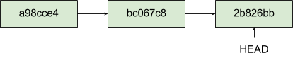

# Лабораторная работа 2.3 Основы ветвления Git

**Цель работы:** *исследование базовых возможностей по работе с локальными и удаленными ветками Git.*

## Теоретическое обоснование

Почти каждая система контроля версий (СКВ) в какой-то форме поддерживает ветвление. Используя ветвление, Вы отклоняетесь от основной линии разработки и продолжаете работу независимо от неё, не вмешиваясь в основную линию. Во многих СКВ создание веток — это очень затратный процесс, часто требующий создания новой копии директории, что может занять много времени для большого проекта.

Некоторые люди, говоря о модели ветвления Git, называют ее “киллер-фича”, что выгодно выделяет Git на фоне остальных СКВ. Что в ней такого особенного? Ветвление Git очень легковесно: операция создания ветки выполняется почти мгновенно, переключение между ветками туда-сюда, обычно, также быстро. В отличие от многих других СКВ, Git поощряет процесс работы, при котором ветвление и слияние выполняется часто, даже по несколько раз в день. Понимание и владение этой функциональностью дает вам уникальный и мощный инструмент, который может полностью изменить привычный процесс разработки.

### HEAD

Когда вы делаете коммит, Git сохраняет его в виде объекта, который содержит указатель на снимок (snapshot) подготовленных данных. Этот объект так же содержит имя автора и email, сообщение и указатель на коммит или коммиты непосредственно предшествующие данному (его родителей): отсутствие родителя для первоначального коммита, один родитель для обычного коммита, и несколько родителей для результатов слияния двух и более веток.

Предположим, в вашей рабочей директории есть три файла и вы добавляете их все в индекс и создаёте коммит. Во время индексации вычисляется контрольная сумма каждого файла (SHA-1), затем каждый файл сохраняется в репозиторий (Git называет такой файл *блоб* — большой бинарный объект), а контрольная сумма попадёт в индекс:

```shell
> git add README test.rb LICENSE
> git commit -m "initial commit of my project"
```

Когда вы создаёте коммит командой `git commit`, Git вычисляет контрольные суммы каждого подкаталога (в нашем случае, только основной каталог проекта) и сохраняет его в репозитории как объект дерева каталогов. Затем Git создаёт объект коммита с метаданными и указателем на основное дерево проекта для возможности воссоздать этот снимок в случае необходимости.

Ваш репозиторий Git теперь хранит пять объектов: три блоб объекта (по одному на каждый файл), объект *дерева* каталогов, содержащий список файлов и соответствующих им блобов, а так же объект *коммита*, содержащий метаданные и указатель на объект дерева каталогов.


<center><i>Рисунок 2.1 -- Коммит и его дерево</i></center>

Если вы сделаете изменения и создадите ещё один коммит, то он будет содержать указатель на предыдущий коммит.


<center><i>Рисунок 2.2 -- Коммит и его родители</i></center>

Ветка в Git — это простой перемещаемый указатель на один из таких коммитов. По умолчанию, имя основной ветки в Git — `master`. Как только вы начнёте создавать коммиты, ветка `master` будет всегда указывать на последний коммит. Каждый раз при создании коммита указатель ветки `master` будет передвигаться на следующий коммит автоматически.

> Ветка “master” в Git — это не какая-то особенная ветка. Она точно такая же, как и все остальные ветки. Она существует почти во всех репозиториях только лишь потому, что её создаёт команда `git init`, а большинство людей не меняют её название.

*HEAD* – это указатель, задача которого ссылаться на определенный коммит в репозитории. Суть данного указателя можно попытаться объяснить с разных сторон.

**Во-первых**, *HEAD* – это указатель на коммит в вашем репозитории, который станет родителем следующего коммита. Для того, чтобы лучше понять это, рассмотрим пример  репозитория, в котором сделано сделано шесть коммитов:

```shell
> git log --oneline
cf3d9d8 [add] ignore .tmp files
a7b88ee [create]: git ignore file
c185b80 [create]: header for main
2b826bb [create]: main file of programm
bc067c8 [add]: caption into README file
a98cce4 [create repository]
```

Эти коммиты создавались в порядке от самого нижнего (*a98cce4*) к самому верхнему (*cf3d9d8*). Каждый раз, когда мы отправляли новый коммит в репозиторий, *HEAD* смещался и указывал на него. Посмотрите на картинку ниже: на ней показана ситуация, когда были отправлены три первых коммита.



<center><i>Рисунок 2.3 -- Состояние репозитория после первых трех коммитов</i></center>

После того как вы отправили коммит с *id = 2b826bb*, указатель *HEAD* стал показывать на него, т.е. данный коммит будет родителем для следующего, и когда мы сделаем еще один коммит, *HEAD* сместится.


<center><i>Рисунок 2.4 -- Состояние репозитория после следующего коммита</i></center>

**Во-вторых**, *HEAD* указывает на коммит, относительного которого будет создана рабочая копия во-время операции `checkout`. Другими словами, когда вы переключаетесь с ветки на ветку, используя операцию `checkout`, то в вашем репозитории указатель *HEAD* будет переключаться между последними коммитами выбираемых вами ветвей.

В нашем репозитории пока только одна ветвь – *master*, но и этого будет достаточно, чтобы показать зависимость между положением указателя *HEAD* и операцией `checkout`.

Текущее состояние репозитория выглядит так, как показано на рисунке ниже.


<center><i>Рисунок 2.5 -- Текущее состояние репозитория</i></center>

Для того, чтобы скопировать снимок репозитория относительно последнего коммита ветки *master*, т.е. того на который указывает *HEAD*, необходимо выполнить следующую команду.

```shell
> git checkout master
Switched to branch 'master'
```

Содержимое репозитория, в данном случае, выглядит так.

```shell
> git log --oneline
cf3d9d8 [add] ignore .tmp files
a7b88ee [create]: git ignore file
c185b80 [create]: header for main
2b826bb [create]: main file of programm
bc067c8 [add]: caption into README file
a98cce4 [create repository]
```

Теперь передвинем указатель *HEAD* на коммит с *id=2b826bb*. 


<center><i>Рисунок 2.6 -- Изменение указателя HEAD</i></center>

Для этого передадим команде `checkout` идентификатор коммита.

```shell
> git checkout 2b826bb
Note: checking out '2b826bb'.

You are in 'detached HEAD' state. You can look around, make experimental
changes and commit them, and you can discard any commits you make in this
state without impacting any branches by performing another checkout.

If you want to create a new branch to retain commits you create, you may
do so (now or later) by using -b with the checkout command again. Example:

  git checkout -b <new-branch-name>

HEAD is now at 2b826bb... [create]: main file of programm
```

Обратите внимание на текст, который напечатал *git*, после того, как была выполнена эта команда. Нас интересует самая последняя строка “*HEAD is now at 2b826bb…*”, теперь *HEAD* указывает на коммит с *id=2b826bb* – именно то, что мы хотели. Посмотрим на текущий список коммитов.

```shell
> git log --oneline
2b826bb [create]: main file of programm
bc067c8 [add]: caption into README file
a98cce4 [create repository]
```

*Git* выводит коммиты, которые были сделаны до того коммита, на который ссылается *HEAD*.

Вернем *HEAD* на прежнее место.

```shell
> git checkout cf3d9d8
Previous HEAD position was 2b826bb... [create]: main file of programm
HEAD is now at cf3d9d8... [add] ignore .tmp files

> git log --oneline
cf3d9d8 [add] ignore .tmp files
a7b88ee [create]: git ignore file
c185b80 [create]: header for main
2b826bb [create]: main file of programm
bc067c8 [add]: caption into README file
a98cce4 [create repository]
```

Все вернулось на прежнее место. Таким образом, вы можете получать в виде рабочей копии содержимое репозитория на момент отправки того или иного коммита. Перейдем в каталог .*git*, в котором находится наш репозиторий, он расположен в корневой директории нашего проекта, и посмотрим его содержимое. Для Linux вывод будет следующим:

```shell
> cd .git
> ls -la
total 21
drwxr-xr-x 1 User 197121   0 мар 18 17:10 ./
drwxr-xr-x 1 User 197121   0 мар 18 17:10 ../
-rw-r--r-- 1 User 197121  24 мар  5 23:21 COMMIT_EDITMSG
-rw-r--r-- 1 User 197121 184 мар  5 23:10 config
-rw-r--r-- 1 User 197121  73 мар  5 23:10 description
-rw-r--r-- 1 User 197121  41 мар 18 17:10 HEAD
drwxr-xr-x 1 User 197121   0 мар  5 23:10 hooks/
-rw-r--r-- 1 User 197121 441 мар 18 17:10 index
drwxr-xr-x 1 User 197121   0 мар  5 23:10 info/
drwxr-xr-x 1 User 197121   0 мар  5 23:10 logs/
drwxr-xr-x 1 User 197121   0 мар  5 23:21 objects/
drwxr-xr-x 1 User 197121   0 мар  5 23:10 refs/
```

Для Windows вывод будет несколько иным:

```powershell
> cd .git
> dir
...
05.07.2020  18:56                54 COMMIT_EDITMSG
05.07.2020  18:56               377 config
27.06.2020  13:51                73 description
30.08.2020  18:25               230 FETCH_HEAD
05.07.2020  18:56                24 HEAD
27.06.2020  13:51    <DIR>          hooks
05.07.2020  18:56             7 578 index
27.06.2020  13:51    <DIR>          info
27.06.2020  13:51    <DIR>          logs
05.07.2020  15:37    <DIR>          objects
05.07.2020  18:56                41 ORIG_HEAD
27.06.2020  13:51               183 packed-refs
27.06.2020  13:51    <DIR>          refs
30.08.2020  18:34               469 sourcetreeconfig.json
               9 файлов          9 029 байт
               5 папок  255 581 499 392 байт свободно
```

В данном каталоге содержится файл *HEAD*, в нем находится идентификатор, на который ссылается данный указатель. Посмотрим содержимое файла *HEAD*. Для Linux это можно сделать с помощью команды:

```shell
> cat HEAD
cf3d9d8f7b283267a085986e85cc8f152cca420d
```

В свою очередь то же самое в Windows можно реализовать как:

```powershell
> type HEAD
cf3d9d8f7b283267a085986e85cc8f152cca420d
```

*HEAD* указывает на коммит *cf3d9d8*. 

### Создание новой ветки

Что же на самом деле происходит при создании ветки? Всего лишь создаётся новый указатель для дальнейшего перемещения. Допустим вы хотите создать новую ветку с именем `testing`. Вы можете это сделать командой `git branch` :

```shell
> git branch testing
```

В результате создаётся новый указатель на текущий коммит.


<center><i>Рисунок 2.7 -- Две ветки указывают на одну и ту же последовательность коммитов</i></center>

Как Git определяет, в какой ветке вы находитесь? Он хранит специальный указатель `HEAD`. Имейте ввиду, что в Git концепция `HEAD` значительно отличается от других систем контроля версий, которые вы могли использовать раньше (Subversion или CVS). Как было сказано ранее, в Git — это указатель на текущую локальную ветку. В нашем случае мы все еще находимся в ветке `master`. Команда `git branch` только *создаёт* новую ветку, но не переключает на неё.


<center><i>Рисунок 2.8 -- HEAD указывает на ветку</i></center>

Вы можете легко это увидеть при помощи простой команды `git log`, которая покажет вам куда указывают указатели веток. Эта опция называется `--decorate`.

```shell
> git log --oneline --decorate
f30ab (HEAD, master, testing) add feature #32 - ability to add new
34ac2 fixed bug #1328 - stack overflow under certain conditions
98ca9 initial commit of my project
```

Здесь можно увидеть указывающие на коммит `f30ab` ветки: `master` и `testing`.

### Переключение веток

Для переключения на существующую ветку выполните команду `git checkout`. Давайте переключимся на ветку `testing`:

```shell
> git checkout testing
```

В результате указатель `HEAD` переместится на ветку `testing`.


<center><i>Рисунок 2.9 -- HEAD указывает на текущую ветку</i></center>

Какой в этом смысл? Давайте сделаем ещё один коммит:

```shell
> vim test.rb
> git commit -a -m "made a change"
```


<center><i>Рисунок 2.10 -- Указатель на ветку HEAD переместился вперёд после коммита</i></center>

Интересная ситуация: указатель на ветку `testing` переместился вперёд, а `master` указывает на тот же коммит, где вы были до переключения веток командой `git checkout`. Давайте переключимся назад на ветку `master`:

```shell
> git checkout master
```


<center><i>Рисунок 2.11 -- HEAD перемещается когда вы делаете checkout</i></center>

Эта команда сделала две вещи: переместила указатель `HEAD` назад на ветку `master` и вернула файлы в рабочем каталоге в то состояние, на снимок которого указывает `master`. Это также означает, что все вносимые с этого момента изменения будут относиться к старой версии проекта. Другими словами, вы откатили все изменения ветки `testing` и можете продолжать в другом направлении.

> Важно запомнить, что при переключении веток в Git происходит изменение файлов в рабочей директории. Если вы переключаетесь на старую ветку, то рабочий каталог будет выглядеть так же, как выглядел на момент последнего коммита в ту ветку. Если Git по каким-то причинам не может этого сделать — он не позволит вам переключиться вообще.

### Основы ветвления

Предположим, вы работаете над проектом и уже имеете несколько коммитов.


<center><i>Рисунок 2.12 -- Простая история коммитов</i></center>

Вы решаете, что теперь вы будете заниматься проблемой #53 из вашей системы отслеживания ошибок. Чтобы создать ветку и сразу переключиться на нее, можно выполнить команду `git checkout` с параметром `-b`:

```shell
> git checkout -b iss53
Switched to a new branch "iss53"
```

Это тоже самое что и:

```shell
> git branch iss53
> git checkout iss53
```


<center><i>Рисунок 2.13 -- Создание нового указателя ветки</i></center>

Вы работаете над своим сайтом и делаете коммиты. Это приводит к тому, что ветка `iss53` движется вперед, так как вы переключились на нее ранее (`HEAD` указывает на нее).

```shell
> vim index.html
> git commit -a -m "added a new footer [issue 53]"
```


<center><i>Рисунок 2.14 -- Ветка iss53 двигается вперед</i></center>

Тут вы получаете сообщение об обнаружении уязвимости на вашем сайте, которую нужно немедленно устранить. Благодаря Git, не требуется размещать это исправление вместе с тем, что вы сделали в `iss53`. Вам даже не придется прилагать усилий, чтобы откатить все эти изменения для начала работы над исправлением. Все, что вам нужно — переключиться на ветку `master`.

Но перед тем как сделать это — имейте в виду, что если ваш рабочий каталог либо область подготовленных файлов содержат изменения, не попавшие в коммит и конфликтующие с веткой, на которую вы хотите переключиться, то Git не позволит вам переключить ветки. Лучше всего переключаться из чистого рабочего состояния проекта. Есть способы обойти это (спрятать (stash) или исправить (amend) коммиты). Теперь предположим, что вы зафиксировали все свои изменения и можете переключиться на ветку `master`:

```shell
> git checkout master
Switched to branch 'master'
```

С этого момента ваш рабочий каталог имеет точно такой же вид, какой был перед началом работы над проблемой #53, и вы можете сосредоточиться на работе над исправлением. Важно запомнить: когда вы переключаете ветки, Git возвращает состояние рабочего каталога к тому виду, какой он имел в момент последнего коммита в эту ветку. Он добавляет, удаляет и изменяет файлы автоматически, чтобы состояние рабочего каталога соответствовало тому, когда был сделан последний коммит.

Теперь вы можете перейти к написанию исправления. Давайте создадим новую ветку для исправления, в которой будем работать, пока не закончим исправление.

```shell
> git checkout -b hotfix
Switched to a new branch 'hotfix'
> vim index.html
> git commit -a -m "fixed the broken email address"
[hotfix 1fb7853] fixed the broken email address
 1 file changed, 2 insertions(+)
```


<center><i>Рисунок 2.15 -- Ветка hotfix основана на ветке master</i></center>

Вы можете прогнать тесты, чтобы убедиться, что ваше исправление делает именно то, что нужно. И если это так — выполнить слияние ветки `hotfix` с веткой `master` для включения изменений в продукт. Это делается командой `git merge`:

```shell
> git checkout master
> git merge hotfix
Updating f42c576..3a0874c
Fast-forward
 index.html | 2 ++
 1 file changed, 2 insertions(+)
```

Заметили фразу “fast-forward” в этом слиянии? Git просто переместил указатель ветки вперед, потому что коммит `C4`, на который указывает слитая ветка `hotfix`, был прямым потомком коммита `C2`, на котором вы находились до этого. Другими словами, если коммит сливается с тем, до которого можно добраться двигаясь по истории прямо, Git упрощает слияние просто перенося указатель ветки вперед, так как нет расхождений в изменениях. Это называется “fast-forward”.

Теперь ваши изменения включены в коммит, на который указывает ветка `master`, и исправление можно внедрять.


<center><i>Рисунок 2.16 -- master перемотан до hotfix</i></center>

После внедрения вашего архиважного исправления вы готовы вернуться к работе над тем, что были вынуждены отложить. Но сначала нужно удалить ветку `hotfix`, потому что она больше не нужна — ветка `master` указывает на то же самое место. Для удаления ветки выполните команду `git branch` с параметром `-d`:

```shell
> git branch -d hotfix
Deleted branch hotfix (3a0874c).
```

Теперь вы можете переключиться обратно на ветку `iss53` и продолжить работу над проблемой #53:

```shell
> git checkout iss53
Switched to branch "iss53"
> vim index.html
> git commit -a -m "finished the new footer [issue 53]"
[iss53 ad82d7a] finished the new footer [issue 53]
1 file changed, 1 insertion(+)
```


<center><i>Рисунок 2.17 -- Продолжение работы над iss53</i></center>

Стоит обратить внимание на то, что все изменения из ветки `hotfix` не включены в вашу ветку `iss53`. Если их нужно включить, вы можете влить ветку `master` в вашу ветку `iss53` командой `git merge master`, или же вы можете отложить слияние этих изменений до завершения работы, и затем влить ветку `iss53` в `master`.

### Основы слияния

Предположим, вы решили, что работа по проблеме #53 закончена и её можно влить в ветку `master`. Для этого нужно выполнить слияние ветки `iss53` точно так же, как вы делали это с веткой `hotfix` ранее. Все что нужно сделать — переключиться на ветку, в которую вы хотите включить изменения, и выполнить команду `git merge`:

```shell
> git checkout master
Switched to branch 'master'
> git merge iss53
Merge made by the 'recursive' strategy.
index.html |    1 +
1 file changed, 1 insertion(+)
```

Результат этой операции отличается от результата слияния ветки `hotfix`. В данном случае процесс разработки ответвился в более ранней точке. Так как коммит, на котором мы находимся, не является прямым родителем ветки, с которой мы выполняем слияние, Git придётся немного потрудиться. В этом случае Git выполняет простое трёхстороннее слияние используя последние коммиты объединяемых веток и общего для них родительского коммита.


<center><i>Рисунок 2.18 -- Использование трёх снимков при слиянии</i></center>

Вместо того, чтобы просто передвинуть указатель ветки вперёд, Git создаёт новый результирующий снимок трёхстороннего слияния, а затем автоматически делает коммит. Этот особый коммит называют коммитом слияния, так как у него более одного предка.


<center><i>Рисунок 2.19 -- Коммит слияния</i></center>

Теперь, когда изменения слиты, ветка `iss53` больше не нужна. Вы можете закрыть задачу в системе отслеживания ошибок и удалить ветку:

```shell
> git branch -d iss53
```

### Основные конфликты слияния

Иногда процесс не проходит гладко. Если вы изменили одну и ту же часть одного и того же файла по-разному в двух объединяемых ветках, Git не сможет их чисто объединить. Если ваше исправление ошибки #53 потребовало изменить ту же часть файла что и `hotfix`, вы получите примерно такое сообщение о конфликте слияния:

```shell
> git merge iss53
Auto-merging index.html
CONFLICT (content): Merge conflict in index.html
Automatic merge failed; fix conflicts and then commit the result.
```

Git не создал коммит слияния автоматически. Он остановил процесс до тех пор, пока вы не разрешите конфликт. Чтобы в любой момент после появления конфликта увидеть, какие файлы не объединены, вы можете запустить `git status`:

```shell
> git status
On branch master
You have unmerged paths.
  (fix conflicts and run "git commit")

Unmerged paths:
  (use "git add <file>..." to mark resolution)

    both modified:      index.html

no changes added to commit (use "git add" and/or "git commit -a")
```

Всё, где есть неразрешённые конфликты слияния, перечисляется как неслитое. В конфликтующие файлы Git добавляет специальные маркеры конфликтов, чтобы вы могли исправить их вручную. В вашем файле появился раздел, выглядящий примерно так:

```console
<<<<<<< HEAD:index.html
<div id="footer">contact : email.support@github.com</div>
=======
<div id="footer">
 please contact us at support@github.com
</div>
>>>>>>> iss53:index.html
```

Это означает, что версия из `HEAD` (вашей ветки `master`, поскольку именно её вы извлекли перед запуском команды слияния) — это верхняя часть блока (всё, что над `=======`), а версия из вашей ветки `iss53` представлена в нижней части. Чтобы разрешить конфликт, придётся выбрать один из вариантов, либо объединить содержимое по-своему. Например, вы можете разрешить конфликт, заменив весь блок следующим:

```html
<div id="footer">
please contact us at email.support@github.com
</div>
```

В этом разрешении есть немного от каждой части, а строки `<<<<<<<`, `=======` и `>>>>>>>` полностью удалены. Разрешив каждый конфликт во всех файлах, запустите `git add` для каждого файла, чтобы отметить конфликт как решённый. Добавление файла в индекс означает для Git, что все конфликты в нём исправлены.

Если вы хотите использовать графический инструмент для разрешения конфликтов, можно запустить `git mergetool`, которое проведет вас по всем конфликтам:

```shell
> git mergetool

This message is displayed because 'merge.tool' is not configured.
See 'git mergetool --tool-help' or 'git help config' for more details.
'git mergetool' will now attempt to use one of the following tools:
opendiff kdiff3 tkdiff xxdiff meld tortoisemerge gvimdiff diffuse diffmerge ecmerge p4merge araxis bc3 codecompare vimdiff emerge
Merging:
index.html

Normal merge conflict for 'index.html':
  {local}: modified file
  {remote}: modified file
Hit return to start merge resolution tool (opendiff):
```

Если вы хотите использовать инструмент слияния не по умолчанию (в данном случае Git выбрал `opendiff`, поскольку команда запускалась на Mac), список всех поддерживаемых инструментов представлен вверху после фразы “one of the following tools.” Просто введите название инструмента, который хотите использовать.

После выхода из инструмента слияния Git спросит об успешности процесса. Если вы ответите скрипту утвердительно, то он добавит файл в индекс, чтобы отметить его как разрешенный. Теперь можно снова запустить `git status`, чтобы убедиться в отсутствии конфликтов:

```shell
> git status
On branch master
All conflicts fixed but you are still merging.
  (use "git commit" to conclude merge)

Changes to be committed:

    modified:   index.html
```

Если это вас устраивает и вы убедились, что все файлы, где были конфликты, добавлены в индекс — выполните команду `git commit` для создания коммита слияния. Комментарий к коммиту слияния по умолчанию выглядит примерно так:

```console
Merge branch 'iss53'

Conflicts:
    index.html
#
# It looks like you may be committing a merge.
# If this is not correct, please remove the file
#	.git/MERGE_HEAD
# and try again.


# Please enter the commit message for your changes. Lines starting
# with '#' will be ignored, and an empty message aborts the commit.
# On branch master
# All conflicts fixed but you are still merging.
#
# Changes to be committed:
#	modified:   index.html
#
```

Если вы считаете, что коммит слияния требует дополнительных пояснений — опишите как были разрешены конфликты и почему были применены именно такие изменения, если это не очевидно.

### Управление ветками

Теперь, когда вы уже попробовали создавать, объединять и удалять ветки, пора познакомиться с некоторыми инструментами для управления ветками, которые вам пригодятся, когда вы начнёте использовать ветки постоянно.

Команда `git branch` делает несколько больше, чем просто создаёт и удаляет ветки. При запуске без параметров, вы получите простой список имеющихся у вас веток:

```shell
> git branch
  iss53
* master
  testing
```

Обратите внимание на символ `*`, стоящий перед веткой `master`: он указывает на ветку, на которой вы находитесь в настоящий момент (т. е. ветку, на которую указывает `HEAD`). Это означает, что если вы сейчас сделаете коммит, ветка `master` переместится вперёд в соответствии с вашими последними изменениями. Чтобы посмотреть последний коммит на каждой из веток, выполните команду `git branch -v`:

```shell
> git branch -v
  iss53   93b412c fix javascript issue
* master  7a98805 Merge branch 'iss53'
  testing 782fd34 add scott to the author list in the readmes
```

Опции `--merged` и `--no-merged` могут отфильтровать этот список для вывода только тех веток, которые слиты или ещё не слиты в текущую ветку. Чтобы посмотреть те ветки, которые вы уже слили с текущей, можете выполнить команду `git branch --merged`:

```shell
> git branch --merged
  iss53
* master
```

Ветка `iss53` присутствует в этом списке потому что вы ранее слили её в `master`. Те ветки из этого списка, перед которыми нет символа `*`, можно смело удалять командой `git branch -d`; наработки из этих веток уже включены в другую ветку, так что ничего не потеряется.

Чтобы увидеть все ветки, содержащие наработки, которые вы пока ещё не слили в текущую ветку, выполните команду `git branch --no-merged`:

```shell
> git branch --no-merged
  testing
```

Вы увидите оставшуюся ветку. Так как она содержит ещё не слитые наработки, попытка удалить её командой `git branch -d` приведёт к ошибке:

```shell
> git branch -d testing
error: The branch 'testing' is not fully merged.
If you are sure you want to delete it, run 'git branch -D testing'.
```

Если вы действительно хотите удалить ветку вместе со всеми наработками, используйте опцию `-D`.

> Если в качестве аргумента не указан коммит или ветка, то опции `--merged` и `--no-merged` покажут что уже слито или не слито с вашей *текущей* веткой соответственно.
>
> Вы всегда можете указать дополнительный аргумент для вывода той же информации, но относительно указанной ветки предварительно не извлекая и не переходя на неё.
>
> ```shell
> > git checkout testing
> > git branch --no-merged master
>   topicA
>   featureB
> ```

### Удалённые ветки

Удалённые ссылки — это ссылки (указатели) в ваших удалённых репозиториях, включая ветки, теги и так далее. Полный список удалённых ссылок можно получить с помощью команды `git ls-remote <remote>` или команды `git remote show <remote>` для получения удалённых веток и дополнительной информации. Тем не менее, более распространенным способом является использование веток слежения.

Ветки слежения — это ссылки на определённое состояние удалённых веток. Это локальные ветки, которые нельзя перемещать; Git перемещает их автоматически при любой коммуникации с удаленным репозиторием, чтобы гарантировать точное соответствие с ним. Представляйте их как закладки для напоминания о том, где ветки в удалённых репозиториях находились во время последнего подключения к ним.

Имена веток слежения имеют вид `<remote>/<branch>`. Например, если вы хотите посмотреть, как выглядела ветка `master` на сервере `origin` во время последнего соединения с ним, используйте ветку `origin/master`. Если вы с коллегой работали над одной задачей и он отправил на сервер ветку `iss53`, при том что у вас может быть своя локальная ветка `iss53`, удалённая ветка будет представлена веткой слежения с именем `origin/iss53`.

Возможно, всё это сбивает с толку, поэтому давайте рассмотрим на примере. Скажем, у вас в сети есть свой Git-сервер с адресом `git.ourcompany.com`. Если вы с него что-то склонируете, команда `clone` автоматически назовёт его `origin`, заберёт оттуда все данные, создаст указатель на то, на что там указывает ветка `master`, и назовёт его локально `origin/master`. Git также создаст вам локальную ветку `master`, которая будет начинаться там же, где и ветка `master` в `origin`, так что вам будет с чего начать.

>Подобно названию ветки “master”, “origin” не имеет какого-либо специального значения в Git. В то время как “master” — это название по умолчанию для ветки при выполнении `git init` только потому, что часто используется, “origin” — это название по умолчанию для удалённого сервера, когда вы запускаете `git clone`. Если вы выполните `git clone -o booyah`, то по умолчанию ветка слежения будет иметь вид `booyah/master`.


<center><i>Рисунок 2.20 -- Серверный и локальный репозитории после клонирования</i></center>

Если вы сделаете что-то в своей локальной ветке `master`, а тем временем кто-то отправит изменения на сервер `git.ourcompany.com` и обновит там ветку `master`, то ваши истории продолжатся по-разному. Пока вы не свяжетесь с сервером `origin` ваш указатель `origin/master` останется на месте.


<center><i>Рисунок 2.21 -- Локальная и удалённая работа может расходиться</i></center>

Для синхронизации ваших изменений с удаленным сервером выполните команду `git fetch <remote>` (в нашем случае `git fetch origin`). Эта команда определяет какому серверу соответствует “origin” (в нашем случае это `git.ourcompany.com`), извлекает оттуда данные, которых у вас ещё нет, и обновляет локальную базу данных, сдвигая указатель `origin/master` на новую позицию.


<center><i>Рисунок 2.22 -- git fetch обновляет ветки слежения</i></center>

#### Отправка изменений

Когда вы хотите поделиться веткой, вам необходимо отправить её на удалённый сервер, где у вас есть права на запись. Ваши локальные ветки автоматически не синхронизируются с удалёнными при отправке — вам нужно явно указать те ветки, которые вы хотите отправить. Таким образом, вы можете использовать свои личные ветки для работы, которую не хотите показывать, а отправлять только те тематические ветки, над которыми вы хотите работать с кем-то совместно.

Если у вас есть ветка `serverfix`, над которой вы хотите работать с кем-то ещё, вы можете отправить её точно так же, как вы отправляли вашу первую ветку. Выполните команду `git push <remote> <branch>`:

```shell
> git push origin serverfix
Counting objects: 24, done.
Delta compression using up to 8 threads.
Compressing objects: 100% (15/15), done.
Writing objects: 100% (24/24), 1.91 KiB | 0 bytes/s, done.
Total 24 (delta 2), reused 0 (delta 0)
To https://github.com/schacon/simplegit
 * [new branch]      serverfix -> serverfix
```

Это в некотором роде сокращение. Git автоматически разворачивает имя ветки `serverfix` до `refs/heads/serverfix:refs/heads/serverfix`, что означает “возьми мою локальную ветку `serverfix` и обнови ей удалённую ветку `serverfix`”. Вы также можете выполнить `git push origin serverfix:serverfix` — произойдёт то же самое — здесь говорится “возьми мою ветку `serverfix` и сделай её удалённой веткой `serverfix`”. Можно использовать этот формат для отправки локальной ветки в удалённую ветку с другим именем. Если вы не хотите, чтобы на удалённом сервере ветка называлась `serverfix`, то вместо предыдущей команды выполните `git push origin serverfix:awesomebranch`, которая отправит локальную ветку `serverfix` в ветку `awesomebranch` удалённого репозитория.

> Если вы используете HTTPS URL для отправки изменений, Git-сервер будет спрашивать имя пользователя и пароль для аутентификации. По умолчанию вам будет предложено ввести эти данные в терминале, чтобы сервер мог определить разрешена ли вам отправка изменений.
>
> Если вы не хотите вводить свои данные каждый раз при отправке изменений, вы можете настроить “credential cache”. Проще всего держать их в памяти несколько минут, это легко настроить с помощью команды `git config --global credential.helper cache`.

В следующий раз, когда один из ваших соавторов будет получать обновления с сервера, он получит ссылку на то, на что указывает `serverfix` на сервере, как удалённую ветку `origin/serverfix`:

```shell
> git fetch origin
remote: Counting objects: 7, done.
remote: Compressing objects: 100% (2/2), done.
remote: Total 3 (delta 0), reused 3 (delta 0)
Unpacking objects: 100% (3/3), done.
From https://github.com/schacon/simplegit
 * [new branch]      serverfix    -> origin/serverfix
```

Необходимо отметить, что при получении данных создаются ветки слежения, вы не получаете автоматически для них локальных редактируемых копий. Другими словами, в нашем случае вы не получите новую ветку `serverfix` — только указатель `origin/serverfix`, который вы не можете изменять.

Чтобы слить эти наработки в свою текущую рабочую ветку, выполните `git merge origin/serverfix`. Если вам нужна локальная ветка `serverfix`, в которой вы сможете работать, то вы можете создать её на основе ветки слежения:

```shell
> git checkout -b serverfix origin/serverfix
Branch serverfix set up to track remote branch serverfix from origin.
Switched to a new branch 'serverfix'
```

Это даст вам локальную ветку, в которой можно работать и которая будет начинаться там же, где и `origin/serverfix`.

#### Отслеживание веток

Получение локальной ветки из удалённой ветки автоматически создаёт то, что называется “веткой слежения” (а ветка, за которой следит локальная называется “upstream branch”). Ветки слежения — это локальные ветки, которые напрямую связаны с удалённой веткой. Если, находясь на ветке слежения, выполнить `git pull`, то Git уже будет знать с какого сервера получать данные и какую ветку использовать для слияния.

При клонировании репозитория, как правило, автоматически создаётся ветка `master`, которая следит за `origin/master`. Однако, при желании вы можете настроить отслеживание и других веток — следить за ветками на других серверах или отключить слежение за веткой `master`. Вы только что видели простейший пример, что сделать это можно с помощью команды `git checkout -b <branch> <remote>/<branch>`. Это часто используемая команда, поэтому Git предоставляет сокращённую форму записи в виде флага `--track`:

```shell
> git checkout --track origin/serverfix
Branch serverfix set up to track remote branch serverfix from origin.
Switched to a new branch 'serverfix'
```

В действительности, это настолько распространённая команда, что существует сокращение для этого сокращения. Если вы пытаетесь извлечь ветку, которая не существует, но существует только одна удалённая ветка с точно таким же именем, то Git автоматически создаст ветку слежения:

```shell
> git checkout serverfix
Branch serverfix set up to track remote branch serverfix from origin.
Switched to a new branch 'serverfix'
```

Чтобы создать локальную ветку с именем, отличным от имени удалённой ветки, просто укажите другое имя:

```shell
> git checkout -b sf origin/serverfix
Branch sf set up to track remote branch serverfix from origin.
Switched to a new branch 'sf'
```

Теперь ваша локальная ветка `sf` будет автоматически получать изменения из `origin/serverfix`.

Если у вас уже есть локальная ветка и вы хотите настроить ее на слежение за удалённой веткой, которую вы только что получили, или хотите изменить используемую upstream-ветку, то воспользуйтесь параметрами `-u` или `--set-upstream-to` для команды `git branch`, чтобы явно установить новое значение.

```shell
> git branch -u origin/serverfix
Branch serverfix set up to track remote branch serverfix from origin.
```

Если вы хотите посмотреть как у вас настроены ветки слежения, воспользуйтесь опцией `-vv` для команды `git branch`. Это выведет список локальных веток и дополнительную информацию о том, какая из веток отслеживается, отстаёт, опережает или всё сразу относительно отслеживаемой.

```shell
> git branch -vv
  iss53     7e424c3 [origin/iss53: ahead 2] forgot the brackets
  master    1ae2a45 [origin/master] deploying index fix
* serverfix f8674d9 [teamone/server-fix-good: ahead 3, behind 1] this should do it
  testing   5ea463a trying something new
```

Итак, здесь мы видим, что наша ветка `iss53` следит за `origin/iss53` и “опережает” её на два изменения — это значит, что у нас есть два локальных коммита, которые не отправлены на сервер. Мы также видим, что наша ветка `master` отслеживает ветку `origin/master` и находится в актуальном состоянии. Далее мы можем видеть, что локальная ветка `serverfix` следит за веткой `server-fix-good` на сервере `teamone`, опережает её на три коммита и отстает на один — это значит, что на сервере есть один коммит, который мы ещё не слили, и три локальных коммита, которые ещё не отправлены на сервер. В конце мы видим, что наша ветка `testing` не отслеживает удаленную ветку.

Важно отметить, что эти цифры описывают состояние на момент последнего получения данных с каждого из серверов. Эта команда не обращается к серверам, а лишь говорит вам о том, какая информация с этих серверов сохранена в локальном кэше. Если вы хотите иметь актуальную информацию об этих числах, вам необходимо получить данные со всех ваших удалённых серверов перед запуском команды. Сделать это можно вот так:

```shell
> git fetch --all 
> git branch -vv
```

#### Получение изменений

Команда `git fetch` получает с сервера все изменения, которых у вас ещё нет, но не будет изменять состояние вашей рабочей директории. Эта команда просто получает данные и позволяет вам самостоятельно сделать слияние. Тем не менее, существует команда `git pull`, которая в большинстве случаев является командой `git fetch`, за которой непосредственно следует команда `git merge`. Если у вас настроена ветка слежения как показано в предыдущем разделе, или она явно установлена, или она была создана автоматически командами `clone` или `checkout`, `git pull` определит сервер и ветку, за которыми следит ваша текущая ветка, получит данные с этого сервера и затем попытается слить удалённую ветку.

### Удаление веток на удалённом сервере

Скажем, вы и ваши соавторы закончили с нововведением и слили его в ветку `master` на удалённом сервере (или в какую-то другую ветку, где хранится стабильный код). Вы можете удалить ветку на удалённом сервере используя параметр `--delete` для команды `git push`. Для удаления ветки `serverfix` на сервере, выполните следующую команду:

```shell
> git push origin --delete serverfix
To https://github.com/schacon/simplegit
 - [deleted]         serverfix
```

Всё, что делает эта строка — удаляет указатель на сервере. Как правило, Git сервер хранит данные пока не запустится сборщик мусора, поэтому если ветка была удалена случайно, чаще всего её легко восстановить.

### Управление ветками на GitHub

Осуществлять работу с ветками можно непосредственно на GitHub. Для этого перейдите в репозиторий и кликните по выпадающему меню в левой части экрана. Там еще написано **Branch: master**. Задайте имя новой ветки и выберите **Create branch** (либо нажмите `Enter` на клавиатуре). Теперь у вас есть две одинаковые ветки. Это отличное место для внесения изменений и тестирования их до слияния с `master`.


<center><i>Рисунок 2.24 -- Создание ветки на GitHub</i></center>

Если вы работаете в отдельной ветке, то изменения затронут только ее. В локальном репозитории можно перевести эти ветки в отслеживаемые.

Если вас устраивают внесенные изменения вы и хотите слить их с основной веткой, создайте Pull request. При коллективной работе вы можете предложить свои изменения через Pull request и попросить проверить их или слить их с нужными ветками.

Pull request можно открыть сразу при создании коммита, даже если вы все еще работаете с кодом. Делается это с сайта GitHub. Допустим, вы внесли изменения в ветку и хотите слить их с `master`. Тогда:

- Кликните по вкладке **Pull request** вверху экрана.
- Нажмите зеленую кнопку **New pull request**.
- Перейдите в поле **Example Comparisons**. Выберите ветку, которую хотите сравнить с `master`.
- Еще раз просмотрите все изменения, убедитесь, что они готовы для коммита.
- Нажмите большую зеленую кнопку **New** **pull request**. Напишите заголовок запроса, дайте краткое описание изменений. Нажмите **Create pull request**.


<center><i>Рисунок 2.25 -- Новый Pull request</i></center>


<center><i>Рисунок 2.26 -- Создание Pull request</i></center>

Если это ваш репозиторий, то слить изменения с `master` можно через зеленую кнопку **Merge pull request**. Нажмите **Confirm merge**. Сразу после объединения нужной ветки с `master` нажмите **Delete branch** в фиолетовом боксе.

Если вы участвуете в чужом проекте, то у участников команды (или проверяющего коммиты) могут возникнуть вопросы или замечания. Хотите внести какие-то изменения? Сейчас — самое время. Сразу по завершению изменений участники проекта смогут развертывать эти изменения напрямую из ветки и проводить конечное тестирование до слияния с `master`. Вы также сможете произвести развертку изменений для проверки их в рабочей среде.

После утверждения изменений необходимо произвести слияние вашего кода с веткой `master`. В Pull request хранится запись о ваших изменениях. Таким образом, вы всегда сможете открыть этот запрос и понять, какие изменения были сделаны и почему.

### Перебазирование

В Git есть два способа внести изменения из одной ветки в другую: слияние и перебазирование. Если вы вернётесь к более раннему примеру, вы увидите, что разделили свою работу и сделали коммиты в две разные ветки.


<center><i>Рисунок 2.27 -- История коммитов простого разделения</i></center>

Как мы выяснили ранее, простейший способ выполнить слияние двух веток — это команда `merge`. Она осуществляет трёхстороннее слияние между двумя последними снимками сливаемых веток (`C3` и `C4`) и самого недавнего общего для этих веток родительского снимка (`C2`), создавая новый снимок (и коммит).


<center><i>Рисунок 2.28 -- Слияние разделённой истории коммитов</i></center>

Тем не менее есть и другой способ: вы можете взять те изменения, что были представлены в `C4`, и применить их поверх `C3`. В Git это называется *перебазированием*. С помощью команды `rebase` вы можете взять все коммиты из одной ветки и в том же порядке применить их к другой ветке.

В данном примере переключимся на ветку `experiment` и перебазируем её относительно ветки `master` следующим образом:

```shell
> git checkout experiment
> git rebase master
First, rewinding head to replay your work on top of it...
Applying: added staged command
```

Это работает следующим образом: берётся общий родительский снимок двух веток (текущей, и той, поверх которой вы выполняете перебазирование), определяется дельта каждого коммита текущей ветки и сохраняется во временный файл, текущая ветка устанавливается на последний коммит ветки, поверх которой вы выполняете перебазирование, а затем по очереди применяются дельты из временных файлов.


<center><i>Рисунок 2.29 Перебазирование изменений из C4 поверх C3</i></center>

После этого вы можете переключиться обратно на ветку `master` и выполнить слияние перемоткой.

```console
> git checkout master
> git merge experiment
```


<center><i>Рисунок 2.29 -- Перемотка ветки master</i></center>

Теперь снимок, на который указывает `C4'` абсолютно такой же, как тот, на который указывал `C5` в  примере с трёхсторонним слиянием. Нет абсолютно никакой разницы в конечном результате между двумя показанными примерами, но перебазирование делает историю коммитов чище. Если вы взглянете на историю перебазированной ветки, то увидите, что она выглядит абсолютно линейной: будто все операции были выполнены последовательно, даже если изначально они совершались параллельно.

Часто вы будете делать так для уверенности, что ваши коммиты могут быть бесконфликтно слиты в удалённую ветку — возможно, в проекте, куда вы пытаетесь внести вклад, но владельцем которого вы не являетесь. В этом случае вам следует работать в своей ветке и затем перебазировать вашу работу поверх `origin/master`, когда вы будете готовы отправить свои изменения в основной проект. Тогда владельцу проекта не придётся делать никакой лишней работы — всё решится простой перемоткой или бесконфликтным слиянием.

Учтите, что снимок, на который ссылается ваш последний коммит — является ли он последним коммитом после перебазирования или коммитом слияния после слияния — в обоих случаях это один и тот же снимок, отличаются только истории коммитов. Перебазирование повторяет изменения из одной ветки поверх другой в том порядке, в котором эти изменения были сделаны, в то время как слияние берет две конечные точки и сливает их вместе.

#### Перемещение против слияния

Теперь, когда вы увидели перемещение и слияние в действии, вы можете задаться вопросом, что из них лучше. Прежде чем ответить на этот вопрос, давайте вернёмся немного назад и поговорим о том, что означает история.

Одна из точек зрения заключается в том, что история коммитов в вашем репозитории — это **запись того, что на самом деле произошло**. Это исторический документ, ценный сам по себе, и его нельзя подделывать. С этой точки зрения изменение истории коммитов практически кощунственно; вы *лжёте* о том, что на самом деле произошло. Но что, если произошла путаница в коммитах слияния? Если это случается, репозиторий должен сохранить это для потомков.

Противоположная точка зрения заключается в том, что история коммитов — это **история того, как был сделан ваш проект**. Вы не публикуете первый черновик книги или инструкции по поддержке вашего программного обеспечения, так как это нуждается в тщательном редактировании. Сторонники этого лагеря считают использование инструментов `rebase` и `filter-branch` способом рассказать историю проекта наилучшим образом для будущих читателей.

Теперь к вопросу о том, что лучше — слияние или перебазирование: надеюсь, вы видите, что это не так просто. Git — мощный инструмент, позволяющий вам делать многое с вашей историей, однако каждая команда и каждый проект индивидуален. Теперь, когда вы знаете, как работают оба эти приёма, выбор — какой из них будет лучше в вашей ситуации — зависит от вас.

При этом, вы можете взять лучшее от обоих миров: использовать перебазирование для наведения порядка в истории ваших локальных изменений, но никогда не применять его для уже отправленных куда-нибудь изменений.

## Аппаратура и материалы

1. Компьютерный класс общего назначения с конфигурацией ПК не хуже рекомендованной для OC Windows 10 с подключением к глобальной сети Интернет.
2. Операционная система Windows 10.
3. Система контроля версий Git.
4. Браузер для доступа к web-сервису GitHub, рекомендован к использованию Google Chrome.

## Указания по технике безопасности

При работе на ЭВМ без разрешения руководителя занятия запрещается:

- подавать (снимать) напряжение на ПЭВМ и электрические розетки с распределительного щита;
- включать и выключать блоки питания ПЭВМ и мониторы;
- извлекать ПЭВМ из защитного кожуха;
- устранять неисправности, возникшие в ходе выполнения лабораторной работы.

## Методика и порядок выполнения работы

1. Изучить теоретический материал работы.
2. Создать общедоступный репозиторий на GitHub, в котором будет использована лицензия MIT.
3. Создать три файла: 1.txt, 2.txt, 3.txt.
4. Проиндексировать первый файл и сделать коммит с комментарием "add 1.txt file".
5. Проиндексировать второй и третий файлы.
6. Перезаписать уже сделанный коммит с новым комментарием "add 2.txt
    and 3.txt."
7. Создать новую ветку my_first_branch.
8. Перейти на ветку и создать новый файл in_branch.txt, закоммитить изменения.
9. Вернуться на ветку master.
10. Создать и сразу перейти на ветку new_branch.
11. Сделать изменения в файле 1.txt, добавить строчку “new row in the 1.txt file”, закоммитить изменения.
12. Перейти на ветку master и слить ветки master и my_first_branch, после чего слить ветки master и new_branch.
13. Удалить ветки my_first_branch и new_branch.
14. Создать ветки branch_1 и branch_2.
15. Перейти на ветку branch_1 и изменить файл 1.txt, удалить все содержимое и добавить текст “fix in the 1.txt”, изменить файл 3.txt, удалить все содержимое и добавить текст “fix in the 3.txt”, закоммитить изменения.
16. Перейти на ветку branch_2 и также изменить файл 1.txt, удалить все содержимое и добавить текст “My fix in the 1.txt”, изменить файл 3.txt, удалить все содержимое и добавить текст “My fix in the 3.txt”, закоммитить изменения.
17. Слить изменения ветки branch_2 в ветку branch_1.
18. Решить конфликт файла 1.txt в ручном режиме, а конфликт 3.txt используя команду `git mergetool` c помощью одной из доступных утилит, например Meld.
19. Отправить ветку branch_1 на GitHub. 
20. Создать средствами GitHub удаленную ветку branch_3.
21. Создать в локальном репозитории ветку отслеживания удаленной ветки branch_3.
22. Перейти на ветку branch_3 и добавить файл файл 2.txt строку  "the final fantasy in the 4.txt file".
23. Выполнить перемещение ветки master на ветку branch_2.
24. Отправить изменения веток master и branch_2 на GitHub.
25. Отправьте адрес репозитория GitHub на электронный адрес преподавателя.

## Содержание отчета и его форма

Отчет по лабораторной работе оформляется электронно в формате PDF, должен содержать ответы на контрольные вопросы, ссылку на репозиторий с которым выполнялась работа, скриншоты терминала с командами Git, скриншоты окна браузера после соответствующих изменений репозитория.  

## Вопросы для защиты работы

1. Что такое ветка?
2. Что такое *HEAD*?
3. Способы создания веток.
4. Как узнать текущую ветку?
5. Как переключаться между ветками?
6. Что такое удаленная ветка?
7. Что такое ветка отслеживания?
8. Как создать ветку отслеживания?
9. Как отправить изменения из локальной ветки в удаленную ветку?
10. В чем отличие команд `git fetch` и `git pull`?
11. Как удалить локальную и удаленную ветки?
12. Изучить модель ветвления git-flow (использовать материалы статей https://www.atlassian.com/ru/git/tutorials/comparing-workflows/gitflow-workflow, https://habr.com/ru/post/106912/). Какие основные типы веток присуствуют в модели git-flow? Как организована работа с ветками в модели git-flow? В чем недостатки git-flow?
13. На прошлой лабораторной работе было задание выбрать одно из программных средств с GUI для работы с Git. Необходимо в рамках этого вопроса привести описание инструментов для работы с ветками Git, предоставляемых этим средством.