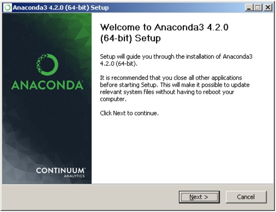
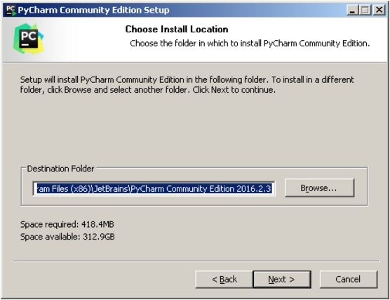
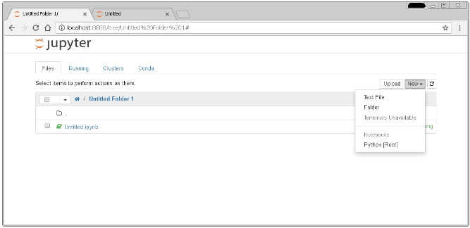

# Лабораторная работа 3.1 Основы языка Python

**Цель работы:** *исследование процесса установки и базовых возможностей языка Python версии 3.x.*

## Теоретическое обоснование

### Версии языка Python

На сегодняшний день существуют две версии Python – это Python 2 и Python 3, у них отсутствует полная совместимость друг с другом. На момент написания статьи вторая версия Python ещё широко используется, но, судя по изменениям, которые происходят, со временем, он останется только для того, чтобы запускать старый код. В нашей с вами работе, мы будем использовать Python 3, и, в дальнейшем, если где-то будет встречаться слово Python, то под ним следует понимать Python 3. Случаи применения Python 2 будут специально оговариваться.

### Установка Python

Для установки интерпретатора Python на ваш компьютер, первое, что нужно сделать – это скачать дистрибутив. Загрузить его  можно с официального сайта, перейдя по ссылке https://www.python.org/downloads/.

#### Установка Python в Windows

Для операционной системы Windows дистрибутив распространяется либо в виде исполняемого файла (с расширением exe), либо в виде архивного файла (с расширением zip). **Если вы используете Windows 7, не забудьте установить Service Pack 1!**


Порядок установки.

1. Запустите скачанный установочный файл.
2. Выберет способ установки.


В данном окне предлагается два варианта *Install Now* и *Customize installation*. При выборе *Install Now*, Python установится в папку по указанному пути. Помимо самого интерпретатора будет установлен IDLE (интегрированная среда разработки), pip (пакетный менеджер) и документация, а также будут созданы соответствующие ярлыки и установлены связи файлов, имеющие расширение .py с интерпретатором Python. *Customize installation* – это вариант настраиваемой установки. Опция Add python 3.5 to PATH нужна для того, чтобы появилась возможность запускать интерпретатор без указания полного пути до исполняемого файла при работе в командной строке.

3. Отметьте необходимые опций установки (доступно при выборе Customize installation)


На этом шаге нам предлагается отметить дополнения, устанавливаемые вместе с интерпретатором Python. Рекомендуется выбрать все опции.

- Documentation – установка документаций.
- pip – установка пакетного менеджера pip.
- tcl/tk and IDLE – установка интегрированной среды разработки (IDLE) и библиотеки для построения графического интерфейса (tkinter).

4. Выберете место установки (доступно при выборе Customize installation)


Помимо указания пути, данное окно позволяет внести дополнительные изменения в процесс установки с помощью опций:

- Install for all users – Установить для всех пользователей. Если не выбрать данную опцию, то будет предложен вариант инсталляции в папку пользователя, устанавливающего интерпретатор.
- Associate files with Python – Связать файлы, имеющие расширение .py, с Python. При выборе данной опции будут внесены изменения в Windows, позволяющие запускать Python скрипты по двойному щелчку мыши.
- Create shortcuts for installed applications – Создать ярлыки для запуска приложений.
- Add Python to environment variables – Добавить пути до интерпретатора Python в переменную PATH.
- Precomple standard library – Провести прекомпиляцию стандартной библиотеки.

Последние два пункта связаны с загрузкой компонентов для отладки, их мы устанавливать не будем.

5. После успешной установки вас ждет следующее сообщение.


####  Установка Python в Linux

Чаще всего интерпретатор Python уже в входит в состав дистрибутива. Это можно проверить набрав в терминале

```shell
$ python
```

или

```shell
$ python3
```

В первом случае, вы запустите Python 2 во втором – Python 3. В будущем, скорее всего, во всех дистрибутивах Linux, включающих Python, будет входить только третья версия. Если у вас, при попытке запустить Python, выдается сообщение о том, что он не установлен, или установлен, но не тот, что вы хотите, то у вас есть два пути: а) собрать Python из исходников; б) взять из репозитория.

Для установки из репозитория в Ubuntu воспользуйтесь командой

```shell
$ sudo apt-get install python3
```

### Установка Anaconda

Для удобства запуска примеров и изучения языка Python, настоятельно рекомендуется установить на свой ПК пакет Anaconda. Этот пакет включает в себя интерпретатор языка Python (есть версии 2 и 3), набор наиболее часто используемых библиотек и удобную среду разработки и исполнения, запускаемую в браузере.

Для установки этого пакета, предварительно нужно скачать дистрибутив https://www.continuum.io/downloads.

#### Установка Anaconda в Windows

1. Запустите скачанный инсталлятор. В первом появившемся окне необходимо нажать “Next”.



2. Далее следует принять лицензионное соглашение.


3. Выберете одну из опций установки:

- Just Me – только для пользователя, запустившего установку;
- All Users – для всех пользователей.


4. Укажите путь, по которому будет установлена Anaconda.


5. Укажите дополнительные опции:

- Add Anaconda to the system PATH environment variable – добавить Anaconda в системную переменную PATH
- Register Anaconda as the system Python 3.5 – использовать Anaconda, как интерпретатор Python 3.5 по умолчанию.

Для начала установки нажмите на кнопку “Install”.


5. После этого будет произведена установка Anaconda на ваш компьютер.


#### Установка Anaconda в Linux

1. Скачайте дистрибутив Anaconda для Linux, он будет иметь расширение .sh, и запустите установку командой:

```shell
$ bash имя_дистрибутива.sh
```

В результате вы увидите приглашение к установке. Для продолжения процессе нажмите “Enter”.


2. Прочитайте лицензионное соглашение, его нужно пролистать до конца.


Согласитесь с ним, для этого требуется набрать в командной строке “yes”, в ответе на вопрос инсталлятора:

```
Do you approve the license terms? [yes|no]
```


3. Выберете место установки. Можно выбрать один из следующих вариантов:

- *Press ENTER to confirm the location* – нажмите ENTER для принятия предложенного пути установки. Путь по умолчанию для моей машины: /home/tester/anaconda3, он представлен чуть выше данного меню.
- *Press CTRL-C to abort the installation* – нажмите CTRL-C для отмены установки.
- *Or specify a different location below* – или укажите другой путь в строке ниже.

Нажмите ENTER.


4. После этого начнется установка.


### Установка PyCharm

Если в процессе разработки вам необходим отладчик и вообще вы привыкли работать в IDE, а не в текстовом редакторе, то тогда одним из лучших вариантов будет IDE PyCharm от JetBrains. Для скачивания данного продукта нужно перейти по ссылке https://www.jetbrains.com/pycharm/download/.

IDE доступна для Windows, Linux и MacOS. Существуют два вида лицензии PyCharm – это Professional и Community. Мы будем использовать версию Community, так как она бесплатна и её функционала более чем достаточно для наших задач.

#### Установка PyCharm в Windows

1. Запустите скачанный дистрибутив PyCharm.


2. Выберете путь установки программы.



3. Укажите ярлыки, которые нужно создать на рабочем столе (запуск 32-х и 64-х разрядной версии PyCharm) и отметить опцию из блока Create associations если требуется связать файлы с расширением .py с PyCharm.


4. Выберете имя для папки в меню Пуск.


5. Далее PyCharm будет установлен на ваш компьютер.


#### Установка PyCharm в Linux

1. Скачайте с сайта дистрибутив на компьютер.
2. Распакуйте архивный файл, для этого можно воспользоваться командой:

```shell
$ tar xvf имя_архива.tar.gz
```


Перейдите в каталог, который был создан после распаковки дистрибутива, найдите в нем подкаталог bin и зайдите в него. Запустите pycharm.sh командой:

```shell
$ ./pycharm.sh
```


В результате должен запуститься PyCharm.

### Проверка работоспособности

Теперь проверим работоспособность всего того, что мы установили.

Для начала протестируем интерпретатор в командном режиме. Если вы работаете в Windows, то нажмите сочетание Win+R и в появившемся окне введите python. В Linux откройте окно терминала и в нем введите python3 (или python).

В результате Python запустится в командном режиме, выглядеть это будет примерно так (картинка приведена для Windows, в Linux результат будет аналогичным):


В окне введите:

```python
print("Hello, World!")
```

Результат должен быть следующий:


После проверки введите 

```python
exit()
```

для завершения работы интерпретатора.

#### Проверка Anaconda

Для выполнения проверки работоспособности Anaconda необходимо вначале запустить командный процессор с поддержкой виртуальных окружений Anaconda. В Windows это можно сделать выбрав следующий пункт главного меню системы _Пуск_ \\(\to)\\ _Anaconda3 (64-bit)_ \\(\to)\\ _Anaconda Prompt_. В появившейся командной строке необходимо ввести

```shell
> jupyter notebook
```

в результате чего отобразиться процесс загрузки веб-среды Jupyter Notebook


после чего запустится веб-сервер и среда разработки в браузере.



Создайте ноутбук для разработки, для этого нажмите на кнопку New (в правом углу окна) и в появившемся списке выберете Python.

В результате будет создана новая страница в браузере с ноутбуком. Введите в первой ячейке команду

```python
print("Hello, World!")
```

и нажмите Alt+Enter на клавиатуре. Ниже ячейки должна появиться соответствующая надпись.


#### Проверка PyCharm

Запустите PyCharm и выберете Create New Project в появившемся окне.


Укажите путь до проекта Python и интерпретатор, который будет использоваться для запуска и отладки.


Добавьте Python файл в проект.


Введите код программы.


Запустите программу.


В результате должно открыться окно с выводом программы.


### Запуск программ на Python

Язык Python – это интерпретируемый язык. Это означает, что помимо непосредственно самой программы, вам необходим специальный инструмент для её запуска. Напомню, что существуют компилируемые и интерпретируемые языки программирования. В первом случае, программа с языка высокого уровня переводится в машинный код для конкретной платформы. В дальнейшем, среди пользователей, она, как правило, распространяется в виде бинарного файла. Для запуска такой программы не нужны дополнительные программные средства (за исключением необходимых библиотек, но эти тонкости выходят за рамки нашего обсуждения). Самыми распространенными языками такого типа являются C++ и C. Программы на интерпретируемых языках, выполняются интерпретатором и распространяются в виде исходного кода. На сегодняшний день, среди интерпретируемых языков наиболее популярным является Python.

Python может работать в двух режимах:

- интерактивный;
- пакетный.

В интерактивный режим можно войти, набрав в командной строке

```shell
> python
```

или

```shell
> python3
```

> При работе с Anaconda командная строка должна быть запущена из следующего пункта главного меню системы _Пуск_ \\(\to\\) _Anaconda3 (64-bit)_ \\(\to\\) _Anaconda Prompt_.

В результате Python запустится в интерактивном режиме и будет ожидать ввод команд пользователя.


Если же у вас есть файл с исходным кодом на Python, и вы его хотите запустить, то для этого нужно в командной строке вызвать интерпретатор Python и в качестве аргумента передать ваш файл. Например, для файла с именем _test.py_ процедура запуска будет выглядеть так:

```shell
> python test.py
```

#### Интерактивный режим

Откройте Python в интерактивном режиме и наберите в нем следующее:

```python
print("Hello, World!")
```

И нажмите ENTER.

В ответ на это интерпретатор выполнит данную строку и отобразит строкой ниже результат своей работы.


Python можно использовать как калькулятор для различных вычислений, а если дополнительно подключить необходимые математические библиотеки, то по своим возможностям он становится практически равным таким пакетам как Matlab, Octave и т.п.

Для выхода из интерактивного режима, наберите команду

```python
exit()
```

и нажмите ENTER.

#### Пакетный режим

Теперь запустим Python в режиме интерпретации файлов с исходным кодом (пакетный режим). Создайте файл с именем _test.py_, откройте его с помощью любого текстового редактора и введите следующий код:

```python
a = int(input())

print(a**2)
```

Эта программа принимает целое число на вход и выводит его квадрат. Для запуска, наберите в командной строке

```shell
> python test.py
```

Пример работы программы приведен в окне ниже.


### Типы и модель данных в языке Python

Если достаточно формально подходить к вопросу о типизации языка Python, то можно сказать, что он относится к языкам с неявной сильной динамической типизацией.

Неявная типизация означает, что при объявлении переменной вам не нужно указывать её тип, при явной – это делать необходимо. В качестве примера языков с явной типизацией можно привести Java, C++. Вот как будет выглядеть объявление целочисленной переменной в Java и Python.

Java:

```java
int a = 1;
```

Python:

```python
a = 1
```

Также языки бывают с динамической и статической типизацией. В первом случае тип переменной определяется непосредственно при выполнении программы, во втором – на этапе компиляции. Как уже было сказано Python – это динамически типизированный язык, такие языки как С, C#, Java – статически типизированные.

Сильная типизация не позволяет производить операции в выражениях с данными различных типов, слабая – позволяет. В языках с сильной типизацией вы не можете складывать например строки и числа, нужно все приводить к одному типу. К первой группе можно отнести Python, Java, ко второй – С и С++.

#### Типы данных в Python

В Python типы данных можно разделить на встроенные в интерпретатор *(built-in*) и не встроенные, которые можно использовать при импортировании соответствующих модулей.

К основным встроенным типам относятся:

1. *None* (неопределенное значение переменной)
2. Логические переменные (*Boolean Type*)
3. Числа (*Numeric Type*)
   1. *int* – целое число
   2. *float* – число с плавающей точкой
   3. *complex* – комплексное число
4. Списки (*Sequence Type*)
   1. *list* – список
   2. *tuple* – кортеж
   3. *range* – диапазон
5. Строки (*Text Sequence Type* )
   1. *str*
6. Бинарные списки (*Binary Sequence Types*)
   1. *bytes* – байты
   2. *bytearray* – массивы байт
   3. *memoryview* – специальные объекты для доступа к внутренним данным объекта через protocol buffer
7. Множества (*Set Types*)
   1. *set* – множество
   2. *frozenset* – неизменяемое множество
8. Словари (*Mapping Types*)
   1. *dict* – словарь

#### Модель данных

Рассмотрим как создаются объекты в памяти, их устройство, процесс объявления новых переменных и работу операции присваивания.

Для того, чтобы объявить и сразу инициализировать переменную необходимо написать её имя, потом поставить знак равенства и значение, с которым эта переменная будет создана. Например строка:

```python
b = 5
```

объявляет переменную b и присваивает ей значение 5.

Целочисленное значение 5 в рамках языка Python по сути своей является объектом. Объект, в данном случае – это абстракция для представления данных, данные – это числа, списки, строки и т.п. При этом, под данными следует понимать как непосредственно сами объекты, так и отношения между ними (об этом чуть позже). Каждый объект имеет три атрибута – это идентификатор, значение и тип. Идентификатор – это уникальный признак объекта, позволяющий отличать объекты друг от друга, а значение – непосредственно информация, хранящаяся в памяти, которой управляет интерпретатор.

При инициализации переменной, на уровне интерпретатора, происходит следующее:

- создается целочисленный объект 5 (можно представить, что в этот момент создается ячейка и 5 кладется в эту ячейку);
- данный объект имеет некоторый идентификатор, значение: 5, и тип: целое число;
- посредством оператора “=” создается ссылка между переменной b и целочисленным объектом 5 (переменная b ссылается на объект 5).

Имя переменной не должно совпадать с ключевыми словами интерпретатора Python. Список ключевых слов можно получить непосредственно в программе, для этого нужно подключить модуль *keyword* и воспользоваться командой *keyword.kwlist.*

```python
>>> import keyword
>>> print("Python keywords: ", keyword.kwlist)
```

Проверить является или нет идентификатор ключевым словом можно так:

```python
>>> keyword.iskeyword("try")
True
>>> keyword.iskeyword("b")
False
```

Для того, чтобы посмотреть на объект с каким идентификатором ссылается данная переменная, можно использовать функцию *id()*.

```python
>>> a = 4
>>> b = 5
>>> id(a)
1829984576
>>> id(b)
1829984592
>>> a = b
>>> id(a)
1829984592
```

Как видно из примера, идентификатор – это некоторое целочисленное значение, посредством которого уникально адресуется объект. Изначально переменная *a* ссылается на объект 4 с идентификатором 1829984576, переменная *b* – на объект с *id* = 1829984592. После выполнения операции присваивания *a = b*, переменная *a* стала ссылаться на тот же объект, что и *b*.


Тип переменной можно определить с помощью функции *type()*. Пример использования приведен ниже.

```python
>>> a = 10
>>> b = "hello"
>>> c = (1, 2)
>>> type(a)
<class 'int'>
>>> type(b)
<class 'str'>
>>> type(c)
<class 'tuple'>
```

#### Изменяемые и неизменяемые типы данных

В Python существуют изменяемые и неизменяемые типы.

К **неизменяемым** (*immutable*) типам относятся: целые числа (*int*),  числа с плавающей точкой (*float*), комплексные числа (*complex*), логические переменные (*bool*), кортежи (*tuple*), строки (*str*) и неизменяемые множества (*frozen set*).

К **изменяемым** (*mutable*) типам относятся: списки (*list*), множества (*set*), словари (*dict*).

Как уже было сказано ранее, при создании переменной, вначале создается объект, который имеет уникальный идентификатор, тип и значение, после этого переменная может ссылаться на созданный объект.

Неизменяемость типа данных означает, что созданный объект больше не изменяется. Например, если мы объявим переменную *k* = 15, то будет создан объект со значением 15, типа *int* и идентификатором, который можно узнать с помощью функции *id()*.

```python
>>> k = 15
>>> id(k)
1672501744
>>> type(k)
<class 'int'>
```

Объект с *id* = 1672501744 будет иметь значение 15 и изменить его уже нельзя.

Если тип данных изменяемый, то можно менять значение объекта. Например, создадим список [1, 2], а потом заменим второй элемент на 3.

```python
>>> a = [1, 2]
>>> id(a)
47997336
>>> a[1] = 3
>>> a
[1, 3]
>>> id(a)
47997336
```

Как видно, объект на который ссылается переменная *a*, был изменен. Это можно проиллюстрировать следующим рисунком.


В рассмотренном случае, в качестве данных списка, выступают не объекты, а отношения между объектами. Т. е. в переменной *a* хранятся ссылки на объекты содержащие числа 1 и 3, а не непосредственно сами эти числа.

### Арифметические операции

Язык Python, благодаря наличию огромного количества библиотек для решения разного рода вычислительных задач, сегодня является конкурентом таким пакетам как Matlab и Octave. Запущенный в интерактивном режиме, он, фактически, превращается в мощный калькулятор. В этом уроке речь пойдет об арифметических операциях, доступных в данном языке.

Арифметические операции будем изучать применительно к числам, причем работу с комплексными числами разберем отдельно. Также, кратко остановимся на битовых операциях, представлении чисел в разных системах исчисления и коснемся библиотеки math.

Как было сказано в предыдущем ранее, в этом языке существует три встроенных числовых типа данных:

- целые числа (_int_);
- вещественные числа (_float_);
- комплексные числа (_complex_).

Если в качестве операндов некоторого арифметического выражения используются только целые числа, то результат тоже будет целое число. Исключением является операция деления, результатом которой является вещественное число. При совместном использовании целочисленных и вещественных переменных, результат будет вещественным.

#### Арифметические операции с целыми и вещественными числами

Все эксперименты будем производить в Python, запущенном в интерактивном режиме.

*Сложение.*

Складывать можно непосредственно сами числа…

```python
>>> 3+2
5
```

либо переменные, но они должны предварительно быть проинициализированы.

```python
>>> a = 3
>>> b = 2
>>> a + b
5
```

Результат операции сложения можно присвоить другой переменной…

```python
>>> a = 3
>>> b = 2
>>> c = a + b
>>> print(c)
5
```

либо ей же самой, в таком случае можно использовать полную или сокращенную запись, полная выглядит так

```python
>>> a = 3
>>> b = 2
>>> a = a + b
>>> print(a)
5
```

сокращенная так

```python
>>> a = 3
>>> b = 2
>>> a += b
>>> print(a)
5
```

Все перечисленные выше варианты использования операции сложения могут быть применены для всех нижеследующих операций.

*Вычитание.*

```python
>>> 4-2
2
>>> a = 5
>>> b = 7
>>> a - b
-2
```

*Умножение.*

```python
>>> 5 * 8
40
>>> a = 4
>>> a *= 10
>>> print(a)
40
```

*Деление.*

```python
>>> 9 / 3
3.0
>>> a = 7
>>> b = 4
>>> a / b
1.75
```

*Получение целой части от деления.*

```python
>>> 9 // 3
3
>>> a = 7
>>> b = 4
>>> a // b
1
```

*Получение остатка от деления.*

```python
>>> 9 % 5
4
>>> a = 7
>>> b = 4
>>> a % b
3
```

*Возведение в степень.*

```python
>>> 5 ** 4
625
>>> a = 4
>>> b = 3
>>> a ** b
64
```

#### Работа с комплексными числами

Для создания комплексного числа можно использовать функцию _complex(a, b)_, в которую, в качестве первого аргумента, передается действительная часть, в качестве второго – мнимая. Либо записать число в виде  *a + bj*.

Рассмотрим несколько примеров.

Создание комплексного числа.

```python
>>> z = 1 + 2j
>>> print(z)
(1+2j)
>>> x = complex(3, 2)
>>> print(x)
(3+2j)
```

Комплексные числа можно складывать, вычитать, умножать, делить и возводить в степень.

```python
>>> x + z
(4+4j)
>>> x - z
(2+0j)
>>> x * z
(-1+8j)
>>> x / z
(1.4-0.8j)
>>> x ** z
(-1.1122722036363393-0.012635185355335208j)
>>> x ** 3
(-9+46j)
```

У комплексного числа можно извлечь действительную и мнимую части.

```python
>>> x = 3 + 2j
>>> x.real
3.0
>>> x.imag
2.0
```

Для получения комплексносопряженного число необходимо использовать метод conjugate().

```python
>>> x.conjugate()
(3-2j)
```

#### Битовые операции

В Python доступны битовые операции, их можно производить над целыми числами.

*Побитовое И (AND).*

```python
>>> p = 9
>>> q = 3
>>> p & q
1
```

*Побитовое ИЛИ (OR).*

```python
>>> p | q
11
```

*Побитовое Исключающее ИЛИ (XOR).*

```python
>>> p ^ q
10
```

*Инверсия.*

```python
>>> ~p
-10
```

*Сдвиг вправо и влево.*

```python
>>> p << 1
18
>>> p >> 1
4
```

#### Представление чисел в других системах счисления

В своей повседневной жизни мы используем десятичную систему исчисления, но при программирования, очень часто, приходится работать с шестнадцатеричной, двоичной и восьмеричной.

Представление числа в шестнадцатеричной системе

```python
>>> m = 124504
>>> hex(m)
'0x1e658'
```

Представление числа в восьмеричной системе

```python
>>> oct(m)
'0o363130'
```

Представление числа в двоичной системе

```python
>>> bin(m)
'0b11110011001011000'
```

#### Библиотека (модуль) math

В стандартную поставку Python входит библиотека _math_, в которой содержится большое количество часто используемых математических функций.

Для работы с данным модулем его предварительно нужно импортировать.

```python
>>> import math
```

Рассмотрим наиболее часто используемые функции.

**math.ceil(x)**

Возвращает ближайшее целое число большее, чем x.

```python
>>> math.ceil(3.2)
4
```

**math.fabs(x)**

Возвращает абсолютное значение числа.

```python
>>> math.fabs(-7)
7.0
```

**math.factorial(x)**

Вычисляет факториал x.

```python
>>> math.factorial(5)
120
```

**math.floor(x)**

Возвращает ближайшее целое число меньшее, чем x.

```python
>>> math.floor(3.2)
3
```

**math.exp(x)**

Вычисляет e**x.

```python
>>> math.exp(3)
20.085536923187668
```

**math.log2(x)**

Логарифм по основанию 2.

**math.log10(x)**

Логарифм по основанию 10.

**math.log(x[, base])**

По умолчанию вычисляет логарифм по основанию e, дополнительно можно указать основание логарифма.

```python
>>> math.log2(8)
3.0
>>> math.log10(1000)
3.0
>>> math.log(5)
1.6094379124341003
>>> math.log(4, 8)
0.6666666666666667
```

**math.pow(x, y)**

Вычисляет значение x в степени y.

```python
>>> math.pow(3, 4)
81.0
```

**math.sqrt(x)**

Корень квадратный от x.

```python
>>> math.sqrt(25)
5.0
```

**math.cos(x)**

Косинус от x.

```python
>>> math.cos(0)
1.0
```

**math.sin(x)**

Синус от x.

```python
>>> math.sin(math.pi / 6)
0.49999999999999994
```

**math.tan(x)**

Тангенс от x.

```python
>>> math.tan(math.pi / 4)
0.9999999999999999
```

**math.acos(x)**

Арккосинус от x.

```python
>>> math.acos(-1)
3.141592653589793
```

**math.asin(x)**

Арксинус от x.

```python
>>> math.asin(1)
1.5707963267948966
```

**math.atan(x)**

Арктангенс от x.

```python
 math.atan(0.5)
0.4636476090008061
```

И напоследок пару констант.

**math.pi**

Число пи.

```python
>>> math.pi
3.141592653589793
```

**math.e**

Число е.

```python
>>> math.e
2.718281828459045
```

Помимо перечисленных, модуль math содержит ещё много различных функций, за более подробной информацией можете обратиться по ссылке https://docs.python.org/3/library/math.html.

### Консольный ввод и вывод данных

Мы уже встречались с функцией `print()`. Она отвечает за вывод данных, по-умолчанию на экран. Если код содержится в файле, то без нее не обойтись. В интерактивном режиме в ряде случаев можно обойтись без нее.

Ввод данных в программу и их вывод важны в программировании. Без ввода программы делали бы одно и то же, исключая случаи, когда в них самих генерируются случайные значения. Вывод позволяет увидеть, использовать, передать дальше результат работы программы.

Обычно требуется, чтобы программа обрабатывала какой-то диапазон различных входных данных, которые поступают в нее из внешних источников. В качестве последних могут выступать файлы, клавиатура, сеть, выходные данные из другой программы. 

#### Вывод данных. Функция print()

Что такое функция в программировании, узнаем позже. Пока будем считать, что print() – это такая команда языка Python, которая выводит то, что в ее скобках на экран.

```python
>>> print(1032)
1032
>>> print(2.34)
2.34
>>> print("Hello")
Hello
```

В скобках могут быть любые типы данных. Кроме того, количество данных может быть различным:

```python
>>> print("a:", 1)
a: 1
>>> one = 1
>>> two = 2
>>> three = 3
>>> print(one, two, three)
1 2 3
```

Можно передавать в функцию print() как непосредственно литералы (в данном случае `"a:"` и `1`), так и переменные, вместо которых будут выведены их значения. Аргументы функции (то, что в скобках), разделяются между собой запятыми. В выводе вместо запятых значения разделены пробелом.

Если в скобках стоит выражение, то сначала оно выполняется, после чего _print()_ уже выводит результат данного выражения:

```python
>>> print("hello" + " " + "world")
hello world
>>> print(10 - 2.5/2)
8.75
```

В _print()_ предусмотрены дополнительные параметры. Например, через параметр _sep_ можно указать отличный от пробела разделитель строк:

```python
>>> print("Mon", "Tue", "Wed", "Thu", "Fri", "Sat", "Sun", sep="-")
Mon-Tue-Wed-Thu-Fri-Sat-Sun
>>> print(1, 2, 3, sep="//")
1//2//3
```

Параметр end позволяет указывать, что делать, после вывода строки. По-умолчанию происходит переход на новую строку. Однако это действие можно отменить, указав любой другой символ или строку:

```python
>>> print(10, end="")
10>>>
```

Обычно, если end используется, то не в интерактивном режиме, а в скриптах, когда несколько выводов подряд надо разделить не переходом на новую строку, а, скажем, запятыми. Сам переход на новую строку обозначается комбинацией символов `"\n"`. Если присвоить это значение параметру end, то никаких изменений в работе функции print() вы не увидите, так как это значение и так присвоено по-умолчанию:

```python
>>> print(10, end='\n')
10
>>>
```

Однако, если надо отступить на одну дополнительную строку после вывода, то можно сделать так:

```python
>>> print(10, end='\n\n')
10
 
>>>
```

Следующее, что стоит рассказать о функции _print()_ – это использование форматирования строк. На самом деле это никакого отношения к _print()_ не имеет, а применяется к строкам. Но обычно используется именно в сочетании с функцией _print()_.

Форматирование может выполняться в так называемом старом стиле или с помощью строкового метода _format_. Старый стиль также называют Си-стилем, так как он схож с тем, как происходит вывод на экран в языке C. Рассмотрим пример:

```python
>>> pupil = "Ben"
>>> old = 16
>>> grade = 9.2
>>> print("It's %s, %d. Level: %f" % (pupil, old, grade))
It's Ben, 16. Level: 9.200000
```

Здесь вместо трех комбинаций символов `%s`, `%d`, `%f` подставляются значения переменных pupil, old, grade. Буквы s, d, f обозначают типы данных – строку, целое число, вещественное число. Если бы требовалось подставить три строки, то во всех случаях использовалось бы сочетание %s.

Хотя в качестве значения переменной grade было указано число 9.2, на экран оно вывелось с дополнительными нулями. Однако мы можем указать, сколько требуется знаков после запятой, записав перед буквой f точку с желаемым числом знаков в дробной части:

```python
>>> print("It's %s, %d. Level: %.1f" % (pupil, old, grade))
It's Ben, 16. Level: 9.2
```

Теперь посмотрим на метод _format()_:

```python
>>> print("This is a {0}. It's {1}.".format("ball", "red"))
This is a ball. It's red.
>>> print("This is a {0}. It's {1}.".format("cat", "white"))
This is a cat. It's white.
>>> print("This is a {0}. It's {1} {2}.".format(1, "a", "number"))
This is a 1. It's a number.
```

В строке в фигурных скобках указаны номера данных, которые будут сюда подставлены. Далее к строке применяется метод _format()_. В его скобках указываются сами данные (можно использовать переменные). На нулевое место подставится первый аргумент метода format(), на место с номером 1 – второй и т. д.

#### Ввод данных. Функция input()

За ввод в программу данных с клавиатуры в Python отвечает функция *input()*. Когда вызывается эта функция, программа останавливает свое выполнение и ждет, когда пользователь введет текст. После этого, когда он нажмет Enter, функция _input()_ заберет введенный текст и передаст его программе, которая уже будет обрабатывать его согласно своим алгоритмам.

Если в интерактивном режиме ввести команду _input()_, то ничего интересного вы не увидите. Компьютер будет ждать, когда вы что-нибудь введете и нажмете Enter или просто нажмете Enter. Если вы что-то ввели, это сразу же отобразиться на экране:

```python
>>> input()
Yes!
'Yes!'
```

Функция _input()_ передает введенные данные в программу. Их можно присвоить переменной. В этом случае интерпретатор не выводит строку сразу же:

```python
>>> answer = input()
No, it is not.
```

В данном случае строка сохраняется в переменной _answer_, и при желании мы можем вывести ее значение на экран:

```python
>>> answer
'No, it is not.'
```

При использовании функции _print()_ кавычки в выводе опускаются:

```
>>> print(answer)
No, it is not.
```

Куда интересней использовать функцию _input()_ в скриптах – файлах с кодом. Рассмотрим такую программу:


При запуске программы, компьютер ждет, когда будет введена сначала одна строка, потом вторая. Они будут присвоены переменным `nameUser` и `cityUser`. После этого значения этих переменных выводятся на экран с помощью форматированного вывода.

Вышеприведенный скрипт далек от совершенства. Откуда пользователю знать, что хочет от него программа? Чтобы не вводить человека в замешательство, для функции _input()_ предусмотрен специальный параметр-приглашение. Это приглашение выводится на экран при вызове _input()_. Усовершенствованная программа может выглядеть так:


Обратите внимание, что в программу поступает строка. Даже если ввести число, функция _input()_ все равно вернет его строковое представление. Но что делать, если надо получить число? Ответ: использовать функции преобразования типов.


В данном случае с помощью функций _int()_ и _float()_ строковые значения переменных `qtyOranges` и `priceOrange` преобразуются соответственно в целое число и вещественное число. После этого новые численные значения присваиваются тем же переменным.

Программный код можно сократить, если преобразование типов выполнить в тех же строках кода, где вызывается функция _input()_:

```python
qtyOranges = int(input("Сколько апельсинов? "))
priceOrange = float(input("Цена одного апельсина? "))
 
sumOranges = qtyOranges * priceOrange
 
print("Заплатите", sumOranges, "руб.")
```

Сначала выполняется функция _input()_. Она возвращает строку, которую функция _int()_ или _float()_ сразу преобразует в число. Только после этого происходит присваивание переменной, то есть она сразу получает численное значение.

## Аппаратура и материалы

1. Компьютерный класс общего назначения с конфигурацией ПК не хуже рекомендованной для OC Windows 10 с подключением к глобальной сети Интернет.
2. Операционная система Windows 10.
3. Система контроля версий Git.
4. Браузер для доступа к web-сервису GitHub, рекомендован к использованию Google Chrome.
5. Дистрибутив языка программирования Python, включающий набор популярных библиотек Anaconda.
6. Интегрированная среда разработки PyCharm Community Edition.

## Указания по технике безопасности

При работе на ЭВМ без разрешения руководителя занятия запрещается:

- подавать (снимать) напряжение на ПЭВМ и электрические розетки с распределительного щита;
- включать и выключать блоки питания ПЭВМ и мониторы;
- извлекать ПЭВМ из защитного кожуха;
- устранять неисправности, возникшие в ходе выполнения лабораторной работы.

## Методика и порядок выполнения работы

1. Изучить теоретический материал работы.
2. Создать общедоступный репозиторий на GitHub, в котором будет использована лицензия MIT и язык программирования Python.
3. Выполните клонирование созданного репозитория.
4. Дополните файл `.gitignore` необходимыми правилами для работы с IDE PyCharm.
5. Организуйте свой репозиторий в соответствие с моделью ветвления git-flow.
6. Создайте проект PyCharm в папке репозитория.
7. Решите следующие задачи с помощью языка программирования Python3 и IDE PyCharm:
8. Напишите программу (файл _user.py_), которая запрашивала бы у пользователя:
- его имя (например, "What is your name?")
- возраст ("How old are you?")
- место жительства ("Where are you live?")
После этого выводила бы три строки:

```
   "This is `имя`"
   "It is `возраст`"
   "(S)he live in `место_жительства`"
```

Вместо `имя`, `возраст`, `место_жительства` должны быть данные, введенные пользователем. Примечание: можно писать фразы на русском языке, но если вы планируете стать профессиональным программистом, привыкайте к английскому.

9. Напишите программу (файл _arithmetic.py_), которая предлагала бы пользователю решить пример 4 * 100 - 54. Потом выводила бы на экран правильный ответ и ответ пользователя. Подумайте, нужно ли здесь преобразовывать строку в число.
10. Запросите у пользователя четыре числа (файл _numbers.py_). Отдельно сложите первые два и отдельно вторые два. Разделите первую сумму на вторую. Выведите результат на экран так, чтобы ответ содержал две цифры после запятой.
11. Напишите программу (файл _individual.py_) для решения индивидуального задания. Вариант индивидуального задания уточните у преподавателя. 
12. Выполните коммит файлов _user.py_, _arithmetic.py_,  _numbers.py_ и _individual.py_  в репозиторий git в ветку для разработки.
13. Добавьте отчет по лабораторной работе в _формате PDF_ в папку _doc_ репозитория. Зафиксируйте изменения.
14. Выполните слияние ветки для разработки с веткой _main_/_master_.
15. Отправьте сделанные изменения на сервер GitHub.
16. Отправьте адрес репозитория GitHub на электронный адрес преподавателя.

## Индивидуальные задания

1. Даны два числа. Найти среднее арифметическое и среднее геометрическое их модулей.
2. Даны стороны прямоугольника. Найти его периметр и длину диагонали.
3. Даны стороны треугольника \\(a\\), \\(b\\) и \\(c\\) найти площадь треугольника по формуле Герона
\\[
S = \sqrt{p(p-a)(p-b)(p-c)},
\\]
где \\(p = (a + b + c) / 2\\).
4.	 Даны два числа. Найти их сумму, разность, произведение, а также частное от деления первого числа на второе.
5.	 Даны длины сторон прямоугольного параллелепипеда. Найти его объем и площадь боковой поверхности.
6.	 Даны координаты на плоскости двух точек. Найти расстояние между этими точками.
7.	 Даны основания и высота равнобедренной трапеции. Найти периметр трапеции.
8.	 Даны основания равнобедренной трапеции и угол при большем основании. Найти площадь трапеции.
9.	 Треугольник задан координатами своих вершин. Найти периметр и площадь треугольника.
10.	 Выпуклый четырехугольник задан координатами своих вершин. Найти площадь этого четырехугольника как сумму площадей треугольников.
11.	 Известна стоимость 1 кг конфет, печенья и яблок. Найти стоимость всей покупки, если купили \\(x\\) кг конфет, \\(у\\) кг печенья и \\(z\\) кг яблок.
12.	 Известна стоимость монитора, системного блока, клавиатуры и мыши. Сколько будут стоить 3 компьютера из этих элементов? \\(N\\) компьютеров?
13.	 Возраст Тани – \\(X\\) лет, а возраст Мити – \\(Y\\) лет. Найти их средний возраст, а также определить, на сколько отличается возраст каждого ребенка от среднего значения.
14.	 Два автомобиля едут навстречу друг другу с постоянными скоростями \\(V_1\\) и \\(V_2\\) км/ч. Определить, через какое время автомобили встретятся, если расстояние между ними было \\(S\\) км.
15.	 Два автомобиля едут друг за другом с постоянными скоростями \\(V_1\\) и \\(V_2\\) км/ч (\\(V_1 > V_2\\)). Определить, какое расстояние будет
между ними через 30 мин после того, как первый автомобиль
опередил второй на S км.
16.	 Известно значение температуры по шкале Цельсия. Найти соответствующее значение температуры по шкале:
- Фаренгейта;
- Кельвина.
Для пересчета по шкале Фаренгейта необходимо исходное значение температуры умножить на 1,8 и к результату прибавить 32, а по шкале Кельвина абсолютное значение нуля соответствует –273,15 градуса по шкале Цельсия.
17.	 Напишите программу, в которой вычисляется сумма, разность, произведение, частное и среднее арифметическое двух целых чисел, введенных с клавиатуры. Например, при вводе чисел 2 и 7 должен быть получен ответ вида:

```
2+7=9 2-7=-5 2*7=14 2/7=0.2857142857142857 (2+7)/2=4.5  
```

18. Известны объем и масса тела. Определить плотность материала этого тела.
19.	 Известны количество жителей в государстве и площадь его территории. Определить плотность населения в этом государстве.
20.	 Составить программу решения линейного уравнения \\(ax + b = 0, (a \ne 0)\\).
21.  Даны катеты прямоугольного треугольника. Найти его гипотенузу.
22.	 Найти площадь кольца по заданным внешнему и внутреннему радиусам.
23.	 Даны катеты прямоугольного треугольника. Найти его периметр.
24.	 Даны основания и высота равнобедренной трапеции. Найти ее периметр.

### Задачи повышенной сложности

1. Даны цифры двух целых чисел: двузначного \\(a_2a_1\\) и однозначного \\(b\\), где \\(a_1\\) – число единиц, \\(a_2\\) – число десятков. Получить цифры числа, равного сумме заданных чисел (известно, что это число двузначное). Слагаемое – двузначное число и число-результат не определять; условный оператор не использовать.
2. Даны цифры двух двузначных чисел, записываемых в виде \\(a_2a_1\\) и \\(b_2b_1\\), где \\(a_1\\) и \\(b_1\\) – число единиц, \\(a_2\\) и \\(b_2\\) – число десятков. Получить цифры числа, равного сумме заданных чисел (известно, что это число двузначное). Слагаемое – двузначное число и число-результат не определять; условный оператор не использовать.
3.	 Даны цифры двух десятичных целых чисел: трехзначного \\(a_3a_2a_1\\) и двузначного \\(b_2b_1\\), где \\(a_1\\) и \\(b_1\\) – число единиц, \\(a_2\\) и \\(b_2\\) – число десятков, \\(a_3\\) – число сотен. Получить цифры числа, равного сумме заданных чисел (известно, что это число трехзначное). Числа-слагаемые и число-результат не определять; условный оператор не использовать.
4.	 Даны целое число \\(k\\) \\((1 \le k \le 180)\\) и последовательность цифр 10111213...9899, в которой выписаны подряд все двузначные числа. Определить:
- номер пары цифр, в которую входит \\(k\\)-я цифра;
- двузначное число, образованное парой цифр, в которую входит \\(k\\)-я цифра;
- \\(k\\)-ю цифру, если известно, что: \\(k\\) – четное число; \\(k\\) – нечетное число. Величины строкового типа не использовать.

5. Даны целые числа \\(h, m, s\\) \\((0 < h \le 23, 0 \le m \le 59, 0 \le s \le 59)\\), указывающие момент времени: «\\(h\\) часов, \\(m\\) минут, \\(s\\) секунд». Определить угол (в градусах) между положением часовой стрелки в начале суток и в указанный момент времени.
6. С начала суток часовая стрелка повернулась на \\(y\\) градусов (\\(0 \le y < 360\\), \\(y\\) – вещественное число). Определить число полных часов и число полных минут, прошедших с начала суток.
7. Часовая стрелка образует угол y с лучом, проходящим через центр и через точку, соответствующую 12 часам на циферблате, \\(0 < y \le 2\pi\\). Определить значение угла для минутной стрелки, а также количество полных часов и полных минут.  
8. Даны два целых числа \\(a\\) и \\(b\\). Если \\(a\\) делится на \\(b\\) или \\(b\\) делится на \\(a\\), то вывести 1, иначе – любое другое число. Условные операторы и операторы цикла не использовать.  

## Содержание отчета и его форма

Отчет по лабораторной работе оформляется электронно в формате PDF, должен содержать ответы на контрольные вопросы, ссылку на репозиторий с которым выполнялась работа, скриншоты IDE PyCharm, скриншоты результатов работы программ. 

## Вопросы для защиты работы

1. Опишите основные этапы установки Python в Windows и Linux.
2. В чем отличие пакета Anaconda от пакета Python, скачиваемого с официального сайта?
3. Как осуществить проверку работоспособности пакета Anaconda?
4. Как задать используемый интерпретатор языка Python в IDE PyCharm?
5. Как осуществить запуск программы с помощью IDE PyCharm?
6. В чем суть интерактивного и пакетного режимов работы Python?
7. Почему язык программирования Python называется языком динамической типизации?
8. Какие существуют основные типы в языке программирования Python?
9. Как создаются объекты в памяти? Каково их устройство? В чем заключается процесс объявления новых переменных и работа операции присваивания?
10. Как получить список ключевых слов в Python?
11. Каково назначение функций _id()_ и _type()_?
12. Что такое изменяемые и неизменяемые типы в Python.
13. Чем отличаются операции деления и целочисленного деления?
14. Какие имеются средства в языке Python для работы с комплексными числами?
15. Каково назначение и основные функции библиотеки (модуля) _math_? По аналогии с модулем _math_ изучите самостоятельно назначение и основные функции модуля _cmath_.
16. Каково назначение именных параметров `sep` и `end` в функции _print()_?
17. Каково назначение метода _format()_? Какие еще существуют средства для форматирования строк в Python? Примечание: в дополнение к рассмотренным средствам изучите самостоятельно работу с f-строками в Python.
18. Каким образом осуществить ввод с консоли значения целочисленной и вещественной переменной в языке Python?