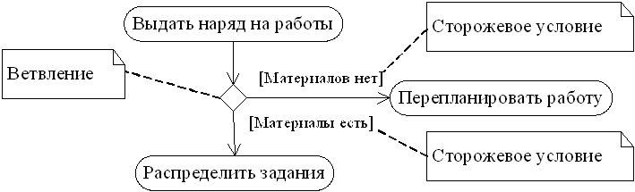

# Лабораторная работа 3.2 Условные операторы и циклы в языке Python

**Цель работы:** *приобретение навыков программирования разветвляющихся алгоритмов и алгоритмов циклической структуры. Освоить операторы языка Python версии 3.x `if`, `while`, `for`, `break` и `continue`, позволяющих реализовывать разветвляющиеся алгоритмы и алгоритмы циклической структуры.*

## Теоретическое обоснование

**Диаграммы деятельности.** Унифицированный язык моделирования (UML) является стандартным инструментом для создания «чертежей» программного обеспечения. С помощью UML можно визуализировать, специфицировать, конструировать и документировать артефакты программных систем. UML пригоден для моделирования любых систем: от информационных систем масштаба предприятия до распределенных Web-приложений и даже встроенных систем реального времени. Это очень выразительный язык, позволяющий рассмотреть систему со всех точек зрения, имеющих отношение к ее разработке и последующему развертыванию. Несмотря на обилие выразительных возможностей, этот язык прост для понимания и использования.

Диаграммы деятельности - это один из пяти видов диаграмм, применяемых в UML для моделирования динамических аспектов поведения системы. Диаграмма деятельности - это, по существу, блок-схема, которая показывает, как поток управления переходит от одной деятельности к другой, однако, по сравнению с последней, у ней есть явные преимущества: поддержка многопоточности и объектно-ориентированного проектирования.

*Диаграмма деятельности* (Activity diagram) показывает поток переходов от одной деятельности к другой. Деятельность (Activity) - это продолжающийся во времени неатомарный шаг вычислений в автомате. Деятельности в конечном счете приводят к выполнению некоего действия (Action), составленного из выполняемых атомарных вычислений, каждое из которых либо изменяет состояние системы, либо возвращает какое-то значение. Действие может заключаться в вызове другой операции, посылке сигнала, создании или уничтожении объекта либо в простом вычислении - скажем, значения выражения. Графически диаграмма деятельности представляется в виде графа, имеющего вершины и ребра.

**Состояние действия и состояние деятельности.** В потоке управления, моделируемом диаграммой деятельности, происходят различные события. Вы можете вычислить выражение, в результате чего изменяется значение некоторого атрибута или возвращается некоторое значение. Также, например, можно выполнить операцию над объектом, послать ему сигнал или даже создать его или уничтожить. Все эти выполняемые атомарные вычисления называются состояниями действия, поскольку каждое из них есть состояние системы, представляющее собой выполнение некоторого действия. Как показано на рис. 1, состояния действия изображаются прямоугольниками с закругленными краями. Внутри такого символа можно записывать произвольное выражение.

|  |  |  |
| ------------------------------------------------------ | ------------------------------------------------------ | ------------------------------------------------------ |
| а)                                                     | б)                                                     | в)                                                     |

<div class="figure-label">Рисунок 1 - Состояния действия и комментарий: а) простое действие; б) выражение; в) комментарий</div>

Состояния действия не могут быть подвергнуты декомпозиции. Кроме того, они атомарны. Это значит, что внутри них могут происходить различные события, но выполняемая в состоянии действия работа не может быть прервана. Обычно предполагается, что длительность одного состояния действия занимает неощутимо малое время. 

В противоположность этому состояния деятельности могут быть подвергнуты дальнейшей декомпозиции, вследствие чего выполняемую деятельность можно представить с помощью других диаграмм деятельности. Состояния деятельности не являются атомарными, то есть могут быть прерваны. Предполагается, что для их завершения требуется заметное время. Можно считать, что состояние действия - это частный вид состояния деятельности, а конкретнее - такое состояние, которое не может быть подвергнуто дальнейшей декомпозиции. А состояние деятельности можно представлять себе как составное состояние, поток управления которого включает только другие состояния деятельности и действий.

**Переходы.** Когда действие или деятельность в некотором состоянии завершается, поток управления сразу переходит в следующее состояние действия или деятельности. Для описания этого потока используются переходы, показывающие путь из одного состояния действия или деятельности в другое. В UML переход представляется простой линией со стрелкой, как показано на рис. 4.2.


<div class="figure-label">Рисунок 2 - Нетриггерные переходы</div>

Поток управления должен где-то начинаться и заканчиваться (разумеется, если это не бесконечный поток, у которого есть начало, но нет конца). Как показано на рисунке, вы можете задать как начальное состояние (закрашенный кружок), так и конечное (закрашенный кружок внутри окружности).

**Ветвление.** Простые последовательные переходы встречаются наиболее часто, но их одних недостаточно для моделирования любого потока управления. Как и в блок-схеме, вы можете включить в модель ветвление, которое описывает различные пути выполнения в зависимости от значения некоторого булевского выражения. Как видно из рис. 4.3, точка ветвления представляется ромбом. В точку ветвления может входить ровно один переход, а выходить - два или более. Для каждого исходящего перехода задается булевское выражение, которое вычисляется только один раз при входе в точку ветвления. Ни для каких двух исходящих переходов эти сторожевые условия не должны одновременно принимать значение «истина», иначе поток управления окажется неоднозначным. Но эти условия должны покрывать все возможные варианты, иначе поток остановится. 

Для удобства разрешается использовать ключевое слово *else* для пометки того из исходящих переходов, который должен быть выбран в случае, если условия, заданные для всех остальных переходов, не выполнены.

Реализовать итерацию можно, если ввести два состояния действия - в первом устанавливается значение счетчика, во втором оно увеличивается - и точку ветвления, вычисление в которой показывает, следует ли прекратить итерации. 


<div class="figure-label">Рисунок 3 - Ветвление</div>

```admonish tip "Определение"
**Алгоритм разветвляющейся структуры** - это алгоритм, в котором вычислительный процесс осуществляется либо по одной, либо по другой ветви, в зависимости от выполнения некоторого условия. Программа разветвляющейся структуры реализует такой алгоритм. В программе разветвляющейся структуры имеется один или несколько условных операторов. Для программной реализации условия используется логическое выражение. В сложных структурах с большим числом ветвей применяют оператор выбора.
```

```admonish tip "Определение"
**Алгоритм циклической структуры** - это алгоритм, в котором происходит многократное повторение одного и того же участка программы. Такие повторяемые участки вычислительного процесса называются циклами.
```

Операторы цикла используются для организации многократно повторяющихся вычислений. Любой цикл состоит из тела цикла, то есть тех операторов, которые выполняются несколько раз, начальных установок, модификации параметра цикла и проверки условия продолжения выполнения цикла. Один проход цикла называется итерацией. Проверка условия выполняется на каждой итерации либо до тела цикла (тогда говорят о цикле с предусловием), либо после тела цикла (цикл с постусловием). Разница между ними состоит в том, что тело цикла с постусловием всегда выполняется хотя бы один раз, после чего проверяется, надо ли его выполнять еще раз. Проверка необходимости вы­полнения цикла с предусловием делается до тела цикла, поэтому возможно, что он не выполнится ни разу.

Переменные, изменяющиеся в теле цикла и используемые при проверке условия продолжения, называются параметрами цикла. Целочисленные параметры цик­ла, изменяющиеся с постоянным шагом на каждой итерации, называются счет­чиками цикла.

Начальные установки могут явно не присутствовать в программе, их смысл со­стоит в том, чтобы до входа в цикл задать значения переменным, которые в нем используются.

Программа циклической структуры содержит один или несколько циклов. Различают детерминированные циклы с заранее известным числом повторений и итерационные циклы, в которых число повторений заранее неизвестно.

## Логические выражения и операторы

### Логические выражения и логический тип данных

Часто в реальной жизни мы соглашаемся с каким-либо утверждением или отрицаем его. Например, если вам скажут, что сумма чисел 3 и 5 больше 7, вы согласитесь, скажете: «Да, это правда». Если же кто-то будет утверждать, что сумма трех и пяти меньше семи, то вы расцените такое утверждение как ложное.

Подобные фразы предполагают только два возможных ответа – либо "да", когда выражение оценивается как правда, истина, либо "нет", когда утверждение оценивается как ошибочное, ложное. В программировании и математике **если результатом вычисления выражения может быть лишь истина или ложь, то такое выражение называется логическим**.

Например, выражение 4 > 5 является логическим, так как его результатом является либо правда, либо ложь. Выражение 4 + 5 не является логическим, так как результатом его выполнения является число.

В предыдущей лабораторной работой мы познакомились с тремя типами данных – целыми и вещественными числами, а также строками. Сегодня введем четвертый – **логический тип данных** (тип *bool*). Его также называют булевым. У этого типа всего два возможных значения: *True* (правда) и *False* (ложь).

```python
>>> a = True
>>> type(a)
<class 'bool'>
>>> b = False
>>> type(b)
<class 'bool'>
```

Здесь переменной `a` было присвоено значение True, после чего с помощью встроенной в Python функции *type()* проверен ее тип. Интерпретатор сообщил, что это переменная класса *bool*. Понятия "класс" и "тип данных" в данном случае одно и то же. Переменная `b` также связана с булевым значением.

В программировании *False* обычно приравнивают к нулю, а *True* – к единице. Чтобы в этом убедиться, можно преобразовать булево значение к целочисленному типу:

```python
>>> int(True)
1
>>> int(False)
0
```

Возможно и обратное. Можно преобразовать какое-либо значение к булевому типу:

```python
>>> bool(3.4)
True
>>> bool(-150)
True
>>> bool(0)
False
>>> bool(' ')
True
>>> bool('')
False
```

И здесь работает правило: всё, что не 0 и не пустота, является правдой.

### Логические операторы

Говоря на естественном языке (например, русском) мы обозначаем сравнения словами "равно", "больше", "меньше". В языках программирования используются специальные знаки, подобные тем, которые используются в математике: > (больше), < (меньше), >= (больше или равно), <= (меньше или равно), == (равно), != (не равно).

Не путайте операцию присваивания значения переменной, обозначаемую в языке Python одиночным знаком "равно", и операцию сравнения (два знака "равно"). Присваивание и сравнение – разные операции.

```python
>>> a = 10
>>> b = 5
>>> a + b > 14
True
>>> a < 14 - b
False
>>> a <= b + 5
True
>>> a != b
True
>>> a == b
False
>>> c = a == b
>>> a, b, c
(10, 5, False)
```

В данном примере выражение `c = a == b` состоит из двух подвыражений. Сначала происходит сравнение (==) переменных `a` и `b`. После этого результат логической операции присваивается переменной c. Выражение `a, b, c` просто выводит значения переменных на экран в интерактивном режиме работы Python.

### Сложные логические выражения

Логические выражения типа `kByte >= 1023` являются простыми, так как в них выполняется только одна логическая операция. Однако, на практике нередко возникает необходимость в более сложных выражениях. Может понадобиться получить ответа "Да" или "Нет" в зависимости от результата выполнения двух простых выражений. Например, "на улице идет снег или дождь", "переменная news больше 12 и меньше 20".

В таких случаях используются специальные операторы, объединяющие два и более простых логических выражения. Широко используются два оператора – так называемые логические И (*and*) и ИЛИ (*or*).

Чтобы получить True при использовании оператора *and*, необходимо, чтобы результаты обоих простых выражений, которые связывает данный оператор, были истинными. Если хотя бы в одном случае результатом будет False, то и все сложное выражение будет ложным.

Чтобы получить True при использовании оператора *or*, необходимо, чтобы результат хотя бы одного простого выражения, входящего в состав сложного, был истинным. В случае оператора *or* сложное выражение становится ложным лишь тогда, когда ложны оба составляющие его простые выражения.

Допустим, переменной `x` было присвоено значение 8 (`x = 8`), переменной `y` присвоили 13 (`y = 13`). Логическое выражение `y < 15 and x > 8` будет выполняться следующим образом. Сначала выполнится выражение `y < 15`. Его результатом будет True. Затем выполнится выражение `x > 8`. Его результатом будет False. Далее выражение сведется к `True and False`, что вернет False.

```python
>>> x = 8
>>> y = 13
>>> y < 15 and x > 8
False
```

Если бы мы записали выражение так: `x > 8 and y < 15`, то оно также вернуло бы False. Однако сравнение `y < 15` не выполнялось бы интерпретатором, так как его незачем выполнять. Ведь первое простое логическое выражение (`x > 8`) уже вернуло ложь, которая, в случае оператора and, превращает все выражение в ложь.

В случае с оператором or второе простое выражение проверяется, если первое вернуло ложь, и не проверяется, если уже первое вернуло истину. Так как для истинности всего выражения достаточно единственного True, неважно по какую сторону от or оно стоит.

```python
>>> y < 15 or x > 8
True
```

В языке Python есть еще унарный логический оператор *not*, т. е. отрицание. Он превращает правду в ложь, а ложь в правду. Унарный он потому, что применяется к одному выражению, стоящему после него, а не справа и слева от него как в случае бинарных and и or.

```python
>>> not y < 15
False
```

Здесь `у < 15` возвращает True. Отрицая это, мы получаем False.

```python
>>> a = 5
>>> b = 0
>>> not a
False
>>> not b
True
```

Число 5 трактуется как истина, отрицание истины дает ложь. Ноль приравнивается к False. Отрицание False дает True.

## Условный оператор ветвления `if`

Оператор ветвления *if* позволяет выполнить определенный набор инструкций в зависимости от некоторого условия. Возможны следующие варианты использования.

### 1. Конструкция `if`

Синтаксис оператора *if* выглядит так.

```python
if выражение:
    инструкция_1
    инструкция_2
    ...
    инструкция_n
```

После оператора *if* записывается выражение. Если это выражение истинно, то выполняются инструкции, определяемые данным оператором. Выражение является истинным, если его результатом является число не равное нулю, непустой объект, либо логическое *True*. После выражения нужно поставить двоеточие “:”.

```admonish warning "Предупреждение"
**ВАЖНО**: блок кода, который необходимо выполнить, в случае истинности выражения, отделяется четырьмя пробелами слева!
```

Примеры:

```python
if 1:
   print("hello 1")
```

Напечатает: *hello 1*

```python
a = 3
if a == 3:
    print("hello 2")
```

Напечатает: *hello 2*

```python
a = 3
if a > 1:
   print("hello 3")
```

Напечатает: *hello 3*

```python
lst = [1, 2, 3]
if lst :
   print("hello 4")
```

Напечатает: *hello 4*

### 2. Конструкция `if` – `else`

Бывают случаи, когда необходимо предусмотреть альтернативный вариант выполнения программы. Т. е. при истинном условии нужно выполнить один набор инструкций, при ложном – другой. Для этого используется конструкция *if – else*.

```python
if выражение:
    инструкция_1
    инструкция_2
    ...
    инструкция_n
else:
    инструкция_a
    инструкция_b
    ...
    инструкция_x
```

Примеры.

```python
a = 3
if a > 2:
   print("H")
else:
   print("L")
```

Напечатает: *H*

```python
a = 1
if a > 2:
   print("H")
else:
   print("L")
```

Напечатает: *L*

Условие такого вида можно записать в строчку, в таком случае оно будет представлять собой *тернарное выражение*.

```admonish tip "Определение"
**Терна́рная усло́вная опера́ция** (от лат. ternarius — «тройной») (обычно записывается как ?:) — во многих языках программирования операция, возвращающая свой второй или третий операнд в зависимости от значения логического выражения, заданного первым операндом. Как можно судить из названия, тернарная операция принимает всего три указанных операнда. Аналогом тернарной условной операции в математической логике и булевой алгебре является условная дизъюнкция, которая записывается в виде [p, q, r] и реализует алгоритм: «Если q, то p, иначе r», что можно переписать как «p или r, в зависимости от q или не q».
```

```python
a = 17
b = True if a > 10 else False
print(b)
```

В результате выполнения такого кода будет напечатано: *True*

### 3. Конструкция `if` – `elif` – `else`

Для реализации выбора из нескольких альтернатив можно использовать конструкцию *if – elif – else*.

```python
if выражение_1:
    инструкции_(блок_1)
elif выражение_2:
    инструкции_(блок_2)
elif выражение_3:
    инструкции_(блок_3)
else:
    инструкции_(блок_4)
```

Пример.

```python
a = int(input("введите число:"))
if a < 0:
   print("Neg")
elif a == 0:
   print("Zero")
else:
   print("Pos")
```

Если пользователь введет число меньше нуля, то будет напечатано “*Neg*“, равное нулю – “*Zero*“, большее нуля – “*Pos*“.

## Оператор цикла `while`

Оператор цикла *while* выполняет указанный набор инструкций до тех пор, пока условие цикла истинно. Истинность условия определяется также как и в операторе *if*. Синтаксис оператора *while* выглядит так.

```python
while выражение:
    инструкция_1
    инструкция_2
    ...
    инструкция_n
```

Выполняемый набор инструкций называется телом цикла.

Пример.

```python
a = 0
while a < 7:
   print("A")
   a += 1
```

Буква “А” будет выведена семь раз в столбик.

Пример бесконечного цикла.

```python
a = 0
while a == 0:
   print("A")
```

### Операторы `break` и `continue`

При работе с циклами используются операторы *break* и *continue*.

Оператор *break* предназначен для досрочного прерывания работы цикла *while*.

Пример.

```python
a = 0
while a >= 0:
   if a == 7:
       break
   a += 1
   print("A")
```

В приведенном выше коде, выход из цикла произойдет при достижении переменной *a* значения 7. Если бы не было этого условия, то цикл выполнялся бы бесконечно.

Оператор *continue* запускает цикл заново, при этом код, расположенный после данного оператора, не выполняется.

Пример.

```python
a = -1
while a < 10:
   a += 1
   if a >= 7:
       continue
   print("A")
```

При запуске данного кода символ “А” будет напечатан 7 раз, несмотря на то, что всего будет выполнено 11 проходов цикла.

## Оператор цикла `for`

Оператор *for* выполняет указанный набор инструкций заданное количество раз, которое определяется количеством элементов в наборе.

Пример. 

```python
for i in range(5):
   print("Hello")
```

В результате *“Hello”* будет выведено пять раз.

Внутри тела цикла можно использовать операторы *break* и *continue*, принцип работы их точно такой же как и в операторе *while*.

Если у вас есть заданный список, и вы хотите выполнить над каждым элементом определенную операцию (возвести в квадрат и напечатать получившееся число), то с помощью *for* такая задача решается так.

```python
lst = [1, 3, 5, 7, 9]
for i in lst:
   print(i ** 2)
```

Также можно пройти по всем буквам в строке.

```python
word_str = "Hello, world!"
for l in word_str:
   print(l)
```

Строка *“Hello, world!”* будет напечатана в столбик.

### Функция `range`

Функция range возвращает неизменяемую последовательность чисел в виде объекта *range*. Синтаксис функции:

```python
range(stop)
range(start, stop[, step])
```

Параметры функции:

- **start** - с какого числа начинается последовательность. По умолчанию - 0
- **stop** - до какого числа продолжается последовательность чисел. Указанное число не включается в диапазон
- **step** - с каким шагом растут числа. По умолчанию 1

Функция *range* хранит только информацию о значениях *start*, *stop* и *step* и вычисляет значения по мере необходимости. Это значит, что независимо от размера диапазона, который описывает функция *range*, она всегда будет занимать фиксированный объем памяти.

Самый простой вариант *range* - передать только значение stop:

```python
>>> range(5)
range(0, 5)

>>> list(range(5))
[0, 1, 2, 3, 4]
```

Если передаются два аргумента, то первый используется как *start*, а второй - как *stop*:

```python
>>> list(range(1, 5))
[1, 2, 3, 4]
```

И чтобы указать шаг последовательности надо передать три аргумента:

```python
>>> list(range(0, 10, 2))
[0, 2, 4, 6, 8]

>>> list(range(0, 10, 3))
[0, 3, 6, 9]
```

С помощью range можно генерировать и убывающие последовательности чисел:

```python
>>> list(range(10, 0, -1))
[10, 9, 8, 7, 6, 5, 4, 3, 2, 1]

>>> list(range(5, -1, -1))
[5, 4, 3, 2, 1, 0]
```

Для получения убывающей последовательности надо использовать отрицательный шаг и соответственно указать start - большим числом, а stop - меньшим.

В убывающей последовательности шаг тоже может быть разным:

```python
>>> list(range(10, 0, -2))
[10, 8, 6, 4, 2]
```

Функция поддерживает отрицательные значения *start* и *stop*:

```python
>>> list(range(-10, 0, 1))
[-10, -9, -8, -7, -6, -5, -4, -3, -2, -1]

>>> list(range(0, -10, -1))
[0, -1, -2, -3, -4, -5, -6, -7, -8, -9]
```

## Структура программы на языке Python

Любая программа на языке Python состоит из **модулей**. Модуль на языке Python представляет собой ряд связанных между собой операций. Модули сохраняются в отдельных файлах с расширением ***.****py*. Сохранённые модули можно использовать в создаваемых программах. Сначала мы будем разрабатывать довольно простые программы, которые практически всегда будут состоять всего из одного модуля.

Модули, в свою очередь, состоят из более простых структурных единиц. В модулях содержится код на языке Python, состоящий из **инструкций**.  Инструкции представляют собой указания компьютеру. Они определяют, какие операции выполнит компьютер с данными. Инструкции в языке Python делятся на простые и составные. Простые инструкции описываются одной строкой кода, составные же – содержат вложенные инструкции.

Инструкции могут содержать **выражения**. И если инструкции определяют, какие действия будут выполнены над информацией, то выражения в составе инструкций определяют, над какими именно данными будут выполнены действия, описанные в инструкции.

Вместе с языком Python поставляется множество стандартных модулей, которые предоставляют программисту большое количество инструментов и возможностей для написания самых разных программ.

Рассмотрим пример. Находясь в интерактивном режиме среды разработки, создадим новый файл, в котором запишем несколько инструкций. Сохраним его под именем *modul_1.py*. Запишем в файле инструкцию вывода `print(2 \* (10 – 4))`. Сохраним файл и запустим инструкцию на выполнение. В главном окне среды разработки было выведено значение записанного нами выражения, то есть 12.

В описанном нами примере, файл *modul_1.py* является модулем, строка, записанная нами в этом файле, является инструкцией, а математическое выражение, записанное в скобках, является выражением.


<div class="figure-label">Рисунок 4 - Структура одномодульной программы</div>

Достаточно часто модуль языка Python может выполняться и самостоятельно, и может быть импортирован как модуль другим модулем. Так как импорт модуля запускает этот модуль, часто надо указать, что какие-то строки не должны выполняться при импорте.

В Python есть специальный прием, который позволяет указать, что какой-то код не должен выполняться при импорте: все строки, которые находятся в блоке `if __name__ == '__main__'` не выполняются при импорте.

Переменная `__name__` -- это специальная переменная, которая будет равна `"__main__"`, только если файл запускается как основная программа, и выставляется равной имени модуля при импорте модуля. То есть, условие `if __name__ == '__main__'` проверяет, был ли файл запущен напрямую.

~~~admonish tip "Определение"
**Шебанг**  (англ. shebang, sha-bang, hashbang, pound-bang, or hash-pling) — в программировании последовательность из двух символов: решётки и восклицательного знака (`#!`) в начале файла скрипта.

Когда скрипт с шебангом выполняется как программа в Unix-подобных операционных системах, загрузчик программ рассматривает остаток строки после шебанга как имя файла программы-интерпретатора. Загрузчик запускает эту программу и передаёт ей в качестве параметра имя файла скрипта с шебангом. Например, если полное имя файла скрипта *path/to/script* и первая строка этого файла:

```shell
#!/bin/sh
```

то загрузчик запускает на выполнение */bin/sh* (обычно это Bourne shell или совместимый интерпретатор командной строки) и передаёт *path/to/script* как первый параметр.
~~~

Строка с шебангом обычно пропускается интерпретатором, так как символ `#` является символом начала комментариев во многих скриптовых языках. Для языка Python3 рекомендуется использовать следующий шебанг:

```python
#!/usr/bin/env python3
```

Помимо этого необходимо добавить информацию о кодировке исходного файла кода:

```python
# -*- coding: utf-8 -*-
```

Таким образом, исполняемый модуль на языке Python для совместимости с Unix-подобными операционными системами должен начинаться со следующих строк:

```python
#!/usr/bin/env python3
# -*- coding: utf-8 -*-
```

```admonish warning "Предупреждение"
**ВАЖНО**: оформление кода на языке Python должно производиться в соответствие со стандартом **PEP8**. Информация о стандарте **PEP8** на русском языке доступна по ссылке https://pep8.ru/doc/pep8/.
```

```admonish example "Пример 1"
Составить UML-диаграмму деятельности и программу с использованием конструкции ветвления и вычислить значение функции
\\[
y = \\begin{cases}
	2x^2 + \cos x,& x \le 3.5, \\\\
	x + 1, & 0 < x < 5, \\\\
	\sin 2x - x^2, & x \ge 5. \\\\
\\end{cases}
\\]
```

**Решение:** Составим UML-диаграмму деятельности вычисления значения функции (рис. 5).


<div class="figure-label">Рисунок 5 - UML-диаграмма деятельности для задачи определения значения функции</div>

По составленной диаграмме может быть написана программа вычисления значения функции.

```python
#!/usr/bin/env python3
# -*- coding: utf-8 -*-

import math


if __name__ == '__main__':
    x = float(input("Value of x? "))

    if x <= 0:
        y = 2 * x * x + math.cos(x)
    elif x < 5:
        y = x + 1
    else:
        y = math.sin(x) - x * x

    print(f"y = {y}")

```

Обратите внимание на использование f-строк для вывода значения переменной *y*.

```admonish example "Пример 2"
Составить UML-диаграмму деятельности и программу для решения задачи: с клавиатуры вводится номер месяца от 1 до 12, необходимо для этого номера месяца вывести наименование времени года.
```

**Решение:** Составим UML-диаграмму деятельности вычисления значения функции (рис. 6).


<div class="figure-label">Рисунок 6 - UML-диаграмма деятельности для задачи вывода наименования сезона</div>

```admonish warning "Предупреждение"
На UML-диаграммах деятельности логическое отношение B в условии обозначается с помощью связки **and**, логическое отношение ИЛИ -- с помощью связки **or**, а логическое отрицание НЕ -- с помощью связки **not**.
```

По составленной диаграмме может быть написана программа решения поставленной задачи.

```python
#!/usr/bin/env python3
# -*- coding: utf-8 -*-

import sys


if __name__ == '__main__':
    n = int(input("Введите номер месяца: "))

    if n == 1 or n == 2 or n == 12:
        print("Зима")
    elif n == 3 or n == 4 or n == 5:
        print("Весна")
    elif n == 6 or n == 7 or n == 8:
        print("Лето")
    elif n == 9 or n == 10 or n == 11:
        print("Осень")
    else:
        print("Ошибка!", file=sys.stderr)
        exit(1)

```

```admonish note "Потоки _stdout_ и _stderr_"
Рассмотрим каким образом реализован вывод ошибок в приведенной выше программе. В операционной системе по умолчанию присутствуют стандартных потока вывода на консоль: буферизованный поток *stdout* для вывода данных и информационных сообщений, а также небуферизованный поток *stderr* для вывода сообщений об ошибках. По умолчанию функция *print* использует поток *stdout*. Для того, чтобы использовать поток *stderr* необходимо передать его в параметре *file* функции *print*. Само же определение потоков *stdout* и *stderr* находится в стандартном пакете Python *sys*. Хорошим стилем программирования является наличие вывода ошибок в стандартный поток *stderr* поскольку вывод в потоки *stdout*  и *stderr* может обрабатываться как операционной системой, так и сценариями пользователя по разному.  
```

Помимо вывода сообщения об ошибке необходимо как-то информировать операционную систему о некорректном завершении программы. Сделать это можно, передав операционной системе код возврата. Если программа завершается успешно, то она передает код возврата равный 0 (любая программа на Python делает это по умолчанию). Если в процессе выполнения программы произошли ошибки, программа должна передать операционной системе код возврата отличный от нуля. В Python завершить программу и передать операционной системе заданный код возврата можно посредством функции *exit*. В данном примере выполняется вызов `exit(1)`, что приводит к немедленному завершению программы и операционной системе передается 1 в качестве кода возврата, что говорит о том, что в процессе выполнения программы произошли ошибки.

```admonish example "Пример 3"
Составить UML-диаграмму деятельности и написать программу, позволяющую вычислить конечную сумму:
\\[
S = \sum_{k=1}^n \frac{\ln kx}{k^2},
\\]
*где \\(n\\) и \\(k\\) вводятся с клавиатуры.*
```

**Решение:** Составим UML-диаграмму деятельности вычисления значения конечной суммы (рис. 7).


<div class="figure-label">Рисунок 7 - UML-диаграмма деятельности для задачи вычисления конечной суммы</div>

По составленной диаграмме может быть написана программа решения поставленной задачи.

```python
#!/usr/bin/env python3
# -*- coding: utf-8 -*-

import math


if __name__ == '__main__':
    n = int(input("Value of n? "))
    x = float(input("Value of x? "))

    S = 0.0
    for k in range(1, n + 1):
        a = math.log(k * x) / (k * k)
        S += a

    print(f"S = {S}")

```

В данном коде следует обратить внимание на выражение`S += a`, который является по сути сокращенной формой выражения `S = S + a`.  Наиболее часто используемые операторы присваивания в Python приведены в табл. 1.

*Таблица 1 - Операторы присваивания Python*

| ОПЕРАТОР | ОПИСАНИЕ                                                     | ПРИМЕР                                                |
| :------- | :----------------------------------------------------------- | :---------------------------------------------------- |
| =        | простой оператор присваивания, присваивает значение с правой стороны операнду с левой стороны; | `c = a + b` присвоит результат `a + b` переменной `c` |
| +=       | оператор присваивания «сложение И», добавляет значение правого оператора левому, и присваивает результат левому операнду; | `c += a` аналогичен `c = c + a`                       |
| -=       | оператор присваивания «вычитание И», вычитает правый оператор из левого и результат присваивает левому операнду; | `c -= a` аналогичен `c = c — a`                       |
| *=       | оператор присваивания «умножение И», умножает правый оператор на левый и присваивает результат левому операнду; | `c *= a` аналогичен `c = c * a`                       |
| /=       | оператор присваивания «деление И», делит левый оператор на правый и присваивает результат левому операнду; | `c /= a` аналогичен `c = c / a`                       |
| %=       | оператор присваивания «модуль И», получает модуль из обоих операторов и присваивает значение левому операнду; | `c %= a` аналогичен `c = c % a`                       |
| **=      | оператор присваивания «возведение в степень И», выполняет возведение в степень операндов и присваивает результат левому операнду; | `c **= а` аналогичен `c = c ** a`                     |
| //=      | оператор присваивания «деление с остатком И», выполняет деление с остатком и присваивает результат левому операнду; | `c //= a` аналогичен `с = c // a`                     |

```admonish example "Пример 4"
Найти значение квадратного корня \\(x = \sqrt a\\) из положительного числа \\(a\\) вводимого с клавиатуры, с некоторой заданной точностью \\(\varepsilon\\) с помощью рекуррентного соотношения:
\\[
x_{n + 1} = \frac 12\cdot\left(x_n + \frac{a}{x_n}\right).
\\]

В качестве начального значения примем \\(x_0 = 1\\). Цикл должен выполняться до тех пор, пока не будет выполнено условие \\(|x_{n+1} - x_n| \le\varepsilon\\). Сравните со значением квадратного корня, полученным с использованием функций стандартной библиотеки. Значение \\(\varepsilon = 10^{-10}\\).
```

**Решение:** Напишем программу для решения поставленной задачи.

```python
#!/usr/bin/env python3
# -*- coding: utf-8 -*-

import math
import sys


if __name__ == '__main__':
    a = float(input("Value of a? "))
    if a < 0:
        print("Illegal value of a", file=sys.stderr)
        exit(1)

    x, eps = 1, 1e-10
    while True:
        xp = x
        x = (x + a / x) / 2
        if math.fabs(x - xp) < eps:
            break

    print(f"x = {x}\nX = {math.sqrt(a)}")

```

В данном примере выражение `x, eps = 1, 1e-10` демонстрирует множественное присваивание в языке Python и может быть заменено на два выражения присваивания:

```python
x = 1
eps = 1e-10
```

```admonish example "Пример 5"
Вычислить значение специальной (интегральной показательной) функции
\\[
\mathrm{Ei}(x) = \int_{-\infty}^x \frac{\exp t}t\\,dt = \gamma + \ln x + \sum_{k=1}^\infty \frac{x^k}{k\cdot k!},
\\]
где \\(\gamma = 0.5772156649\dots\\) - постоянная Эйлера, по ее разложению в ряд с точностью \\(\varepsilon = 10^{-10}\\), аргумент \\(x\\) вводится с клавиатуры.
```

*Решение:* Чтобы вычислить сумму ряда найдем рекуррентное соотношение, позволяющее определить следующий член ряда исходя из значения текущего. Для этого разделим следующий член ряда на текущий. Текущий член ряда задается выражением
\\[
a_k = \frac{x^k}{k\cdot k!},
\\]
тогда как следующий член ряда может быть определен следующим образом:
\\[
a_{k+1} = \frac{x^{k+1}}{(k+1)(k+1)!}.
\\]
Воспользовавшись свойством факториала \\((k+1)! = (k+1)\cdot k\\) последнее выражение может быть записано следующим образом:
\\[
a_{k+1} = \frac{x^{k+1}}{(k+1)(k+1)\cdot k!} = \frac{x^{k+1}}{(k+1)^2\cdot k!}.
\\]
Найдем отношение следующего и текущего членов ряда
\\[
\frac{a_{k+1}}{a_k} = \frac{a^{k+1}}{(k+1)^2\cdot k!}:\frac{x^k}{k\cdot k!} = \frac{xk}{(k+1)^2},
\\]
следовательно,
\\[
a_{k+1} = \frac{xk}{(k+1)^2}\cdot a_k.
\\]
Помимо выражения, связывающего \\(a_{k+1}\\) и \\(a_k\\), для вычисления значения рекуррентного соотношения необходимо найти значение первого члена ряда. В данном случае
\\[
a_1 = \frac{x^1}{1\cdot 1!}=x.
\\]
Условие завершения вычисления суммы ряда может быть записано следующим образом \\(|a_k| \le \varepsilon\\). Программа имеет следующий вид:

```python
#!/usr/bin/env python3
# -*- coding: utf-8 -*-

import math
import sys

# Постоянная Эйлера.
EULER = 0.5772156649015328606
# Точность вычислений.
EPS = 1e-10


if __name__ == '__main__':
    x = float(input("Value of x? "))
    if x == 0:
        print("Illegal value of x", file=sys.stderr)
        exit(1)

    a = x
    S, k = a, 1

    # Найти сумму членов ряда.
    while math.fabs(a) > EPS:
        a *= x * k / (k + 1) ** 2
        S += a
        k += 1

    # Вывести значение функции.
    print(f"Ei({x}) = {EULER + math.log(math.fabs(x)) + S}")

```

## Аппаратура и материалы

1. Компьютерный класс общего назначения с конфигурацией ПК не хуже рекомендованной для OC Windows 10 с подключением к глобальной сети Интернет.
2. Операционная система Windows 10.
3. Система контроля версий Git.
4. Браузер для доступа к web-сервису GitHub, рекомендован к использованию Google Chrome.
5. Дистрибутив языка программирования Python, включающий набор популярных библиотек Anaconda.
6. Интегрированная среда разработки PyCharm Community Edition.

## Указания по технике безопасности

При работе на ЭВМ без разрешения руководителя занятия запрещается:

- подавать (снимать) напряжение на ПЭВМ и электрические розетки с распределительного щита;
- включать и выключать блоки питания ПЭВМ и мониторы;
- извлекать ПЭВМ из защитного кожуха;
- устранять неисправности, возникшие в ходе выполнения лабораторной работы.

## Методика и порядок выполнения работы

1. Изучить теоретический материал работы.
2. Создать общедоступный репозиторий на GitHub, в котором будет использована лицензия MIT и язык программирования Python.
3. Выполните клонирование созданного репозитория.
4. Дополните файл `.gitignore` необходимыми правилами для работы с IDE PyCharm.
5. Организуйте свой репозиторий в соответствие с моделью ветвления git-flow.
6. Самостоятельно изучите рекомендации к оформлению исходного кода на языке Python [PEP-8](https://pep8.org/). Выполните оформление исходного примеров лабораторной работы и индивидуальных созданий в соответствие с PEP-8.
7. Создайте проект PyCharm в папке репозитория.
8. Проработайте примеры лабораторной работы. Создайте для каждого примера отдельный модуль языка Python. Зафиксируйте изменения в репозитории.
9. Приведите в отчете скриншоты результатов выполнения каждой из программ примеров при различных исходных данных вводимых с клавиатуры.
10. Для примеров 4 и 5 постройте UML-диаграмму деятельности. Для построения диаграмм деятельности использовать веб-сервис Google https://www.diagrams.net/.
11. Выполните индивидуальные задания, согласно своего варианта. Для заданий повышенной сложности номер варианта должен быть получен у преподавателя.
12. Приведите в отчете скриншоты работы программ и UML-диаграммы деятельности решения индивидуальных заданий.
13. Зафиксируйте сделанные изменения в репозитории.
14. Добавьте отчет по лабораторной работе в _формате PDF_ в папку _doc_ репозитория. Зафиксируйте изменения.
15. Выполните слияние ветки для разработки с веткой _main_ / _master_.
16. Отправьте сделанные изменения на сервер GitHub.
17. Отправьте адрес репозитория GitHub на электронный адрес преподавателя.

## Индивидуальные задания

### Задание 1

Решить задачу согласно варианта, составить UML-диаграмму деятельности и программу с использованием конструкций ветвления. Номер варианта необходимо получить у преподавателя.

1. Дано натуральное число \\(n > 100\\). Вывести на экран фразу `Мне n лет`, учитывая, что при некоторых значениях n слово «лет» надо заменить на слово «год» или «года».
2. Дано число \\(m\\) (\\(1 \le m \le 12\\)). Определить, сколько дней в месяце с номером \\(m\\).
3. Дано число \\(m\\) (\\(1 \le m \le 7\\)). Вывести на экран название дня недели, который соответствует этому номеру.
4. С клавиатуры вводится натуральное число \\(n\\). В зависимости от значения остатка \\(r\\) при делении числа \\(n\\) на 7 вывести на экран число \\(n\\) в виде `n = 7*k + r`. Если \\(r = 0\\), то вывести на экран `n = 7*k`.
5. С клавиатуры вводится цифра \\(m\\) (от 1 до 4). Вывести на экран названия месяцев, соответствующих времени года с номером \\(m\\) (считать зиму временем года № 1).
6.  Дано целое число \\(С\\) такое, что \\(|С| < 9\\). Вывести это число в словесной форме, учитывая его знак.
7.  С клавиатуры вводится цифра \\(m\\) (от 1 до 12). Вывести на экран название месяца, соответствующего цифре.
8.  Дано число \\(m\\) (\\(1\le m \le 12\\)). Определить полугодие, на которое приходится месяц с номером \\(m\\) и количество дней в том месяце (год не високосный).
9.  Вводится число экзаменов \\(N\le 20\\). Напечатать фразу `Мы успешно сдали N экзаменов`, согласовав слово "экзамен" с числом \\(N\\).
10. Вводится число карандашей \\(N\le 10\\). Вывести фразу `Я купил N карандашей`, согласовав слово "карандаш" с числом \\(N\\).
11. Компания по снабжению электроэнергией взимает плату с клиентов по тарифу:
- 7 р. за 1 кВт/ч за первые 250 кВт/ч; 
- 17 р. за кВт/ч, если потребление свыше 250, но не превышает 300 кВт/ч; 
- 20 р. за кВт/ч, если потребление свыше 300 кВт/ч. 
Потребитель израсходовал \\(n\\) кВт/ч. Подсчитать плату. 
12. При покупке товара на сумму от 200 до 500 руб предоставляется скидка 3%, при покупке товара на сумму от 500 до 800 - скидка 5%, при покупке товара на сумму от 800 до 1000 руб - скидка 7%, свыше 1000 руб - скидка 9%. Покупатель приобрел 8 рулонов обоев по цене \\(Х_1\\) и две банки краски по цене \\(Х_2\\). Сколько он заплатил?
13. Студенты убирают урожай помидоров. При сборе до 50 кг в день работа оплачивается из расчёта 30 коп. за 1 кг; при сборе от 50 до 75 кг в день - 50 коп. за 1 кг; при сборе от 75 до 90 кг в день - 65 коп. за 1 кг; при сборе свыше 90 кг в день - 70 коп. за 1 кг плюс 20 руб. премия. Студент собрал X кг за день. Определить его заработок.

### Задание 2

Решить задачу согласно варианта, составить UML-диаграмму деятельности и программу с использованием конструкций ветвления. Номер варианта необходимо получить у преподавателя.

1. В японском календаре был принят 60-летний цикл, состоящий из пяти 12-летных подциклов. Внутри подцикла года носили названия животных мыши, коровы, тигра, зайца, дракона, змеи, лошади, овцы, обезьяны, курицы, собаки и свиньи. Попарно года в подцикле обозначались названиями цвета: зеленый, красный, желтый, белый и черный. По номеру года определить его название по японскому календарю, считая за начало очередного цикла 1984 год - год зеленой мыши (1985 - год зеленой коровы, 1986 - год красного тигра, 1987 - год красного зайца и т. д.).
2.  Даны действительные числа \\(x\\) и \\(y\\). Найти \\(U = \max^2(x^2\\,y, x\\,y^2) +\min^2(x -y, x + 2y)\\). Для минимума и максимума использовать условный оператор `if`.
3. Из трех действительных чисел \\(a\\), \\(b\\) и \\(c\\) выбрать те, модули которых не меньше 4.
4.  Напечатать три данных действительных числа \\(a\\), \\(b\\) и \\(c\\) сначала в порядке их возрастания, затем - в порядке убывания.
5.  Определить принадлежит ли точка \\(A(a, b)\\) кольцу определяемому окружностями \\(x^2 + y^2 = 1\\) и \\(x^2 + y^2 = 0.25\\).
6.  Решить квадратное неравенство \\(a\\,x^2 + bx + c > 0\\) (\\(a \ne 0\\)), где \\(a\\), \\(b\\) и \\(c\\) - действительные числа.
7.  Провести исследование биквадратного уравнения \\(a\\,x^4 + b\\,x^2 + c = 0\\) (\\(a \ne 0\\)), где \\(a\\), \\(b\\) и \\(c\\) - действительные числа. Если действительных корней нет, то об этом должно быть выдано сообщение, иначе должны быть выданы 2 или 4 действительных корня.
8.  Решить неравенство \\(\sqrt{a - x} > x - 2\\), где \\(a\\) - произвольное действительное число.
9.  Найти координаты точки пересечения прямых заданных уравнениями \\(a_1x + b_1y + c_1 = 0\\) и \\(a_2x + b_2y + c_2 = 0\\), либо сообщить совпадают, параллельны или не существуют.
10. Вывести на экран большее из трёх заданных чисел.
11. Определить, есть ли среди трёх заданных чисел чётные.
12. Две окружности заданы координатами центра и радиусами. Сколько точек пересечения имеют эти окружности?
13. Составить программу, выясняющую делится ли натуральное число \\(x\\) нацело на натуральное число \\(y\\).
14. Составить программу нахождения из трех чисел наибольшего и наименьшего.
15. Составить программу решения квадратного уравнения. Выводить также комплексные решения.
16. Даны три действительных числа. Составить программу, выбирающую из них те, которые принадлежат интервалу \\((0,1)\\).
17. Определить, есть ли среди трёх заданных чисел нечётные.
18. Даны произвольные действительные числа \\(a\\), \\(b\\) и \\(с\\). Вывести на экран сообщения: треугольник с данными длинами сторон построить можно (указать равнобедренный, равносторонний или разносторонний получится треугольник), либо треугольник с данными длинами сторон построить нельзя.
19. Какая из точек \\(A(a_1, a_2)\\) или \\(B(b_1,b_2)\\) находится дальше от начала координат?
20. Попадёт ли точка \\(А(a_1, a_2)\\) в окружность заданного радиуса с центром в начале координат?
21. Симметричны ли точки \\(M_1(x_1, y_1)\\) и \\(M_2(x_2, y_2)\\) относительно начала координат?
22. Треугольник задан координатами своих вершин. Определить принадлежит ли данная точка треугольнику. Координаты вершин треугольника и координаты точки задать самостоятельно.
23. Симметричны ли точки \\(M_1(x_1, y_1)\\) и \\(M_2(x_2, y_2)\\) относительно оси \\(Оx\\) или относительно оси \\(Оy\\)?

### Задание 3

Составить UML-диаграмму деятельности и программу с использованием конструкций цикла для решения задачи. Номер варианта необходимо получить у преподавателя.

1.  Найти все трехзначные натуральные числа, сумма цифр которых равна их произведению.
2.  Найти сумму целых положительных чисел, больших 20, меньших 100 и кратных 3.
3.  Начав тренировки, спортсмен пробежал 10 км. Каждый следующий день он увеличивал дневную норму на 10% от нормы предыдущего дня. Какой суммарный путь пробежит спортсмен за 7 дней?
4.  Через сколько дней спортсмен из задания 1 будет пробегать в день больше 15 км?
5.  Одноклеточная амеба каждые три часа делится на 2 клетки. Определить, сколько будет клеток через 6 часов.
6.  Напечатать таблицу соответствия между весом в фунтах и весом в кг для значений от 1 до а фунтов с шагом 1 фунт, если 1 фунт = 400 г.
7.  Определить среди всех двузначных чисел те, которые делятся на сумму своих цифр.
8.  Сумма цифр трехзначного числа кратна 7. Само число также делится на 7. Найти все такие числа.
9.  Если к сумме цифр двузначного числа прибавить квадрат этой суммы, то снова получится это двузначное число. Найти все эти числа.
10. Сколько можно купить быков, коров и телят, платя за быка 10 р., за корову - 5 р., а за теленка - 0,5 р., если на 100 р. надо купить 100 голов скота?
11. Составьте программу, которая печатает таблицу умножения натуральных чисел в десятичной системе счисления.
12. Покупатель должен заплатить в кассу \\(S\\) р. У него имеются 1, 2, 5, 10, 100, 500 р. Сколько купюр разного достоинства отдаст покупатель, если он начинает платить с самых крупных.
13. Дано натуральное число \\(n\\). Получить все его натуральные делители.
14. Вычислить сумму всех \\(n\\)-значных чисел (\\(1\le n \le 4\\)).
15. Вычислить сумму всех \\(n\\)-значных чисел, кратных \\(k\\) (\\(1\le n\le 4\\)).
16. Ученик выучил в первый день 5 английских слов. В каждый следующий день он выучивал на 2 слова больше, чем в предыдущий. Сколько английских слов выучит ученик в 10-ый день занятий. 
17. Составьте программу, которая печатает таблицу сложения натуральных чисел в десятичной системе счисления.
18. Составить программу, выдающую 1, если заданное число - простое и 0 - в противном случае. Число называется простым, если он делится только на 1 и на само себя. Делители числа  лежат в  интервале от 2 до корня из \\(k\\), где \\(k\\) - заданное число. 
19. У гусей и кроликов вместе 64 лапы. Сколько могло быть кроликов и гусей (указать все сочетания, которые возможны).
20. Заданы три натуральных числа \\(d\\), \\(m\\), \\(y\\), которые обозначают число, месяц и год. Найти порядковый номер даты, начиная отсчет с начала года.
21. Ежемесячная стипендия студента составляет \\(A\\) р., а расходы на проживание превышают стипендию и составляют \\(B\\) р. в месяц. Рост цен ежемесячно увеличивает расходы на 3%. Составьте программу расчета необходимой суммы денег, которую надо единовременно просить у родителей, чтобы можно было прожить учебный год (10 месяцев), используя только эти деньги и стипендию.
22. Составьте программу, которая по номеру дня в году выводит число и месяц в общепринятой форме (например, 33-й день года - 2 февраля).

### Задание повышенной сложности

Составить UML-диаграмму деятельности, программу и произвести вычисления  вычисление значения специальной функции по ее разложению в ряд с точностью \\(\varepsilon = 10^{-10}\\), аргумент функции $x$ вводится с клавиатуры. Номер варианта необходимо получить у преподавателя.

1. Интегральный синус:

\\[
\mathrm{Si}(x) = \int_0^x \frac{\sin t}t\\,dt = \sum_{n=0}^\infty \frac{(-1)^nx^{2n+1}}{(2n+1)(2n+1)!}.
\\]

2. Интегральный косинус:

\\[
\mathrm{Ci}(x)=\gamma + \ln x + \int_0^x \frac{\cos t - 1}t\\,dt = \gamma + \ln x + \sum_{n=1}^\infty \frac{(-1)^nx^{2n}}{(2n)(2n)!}.
\\]

3. Интегральный гиперболический синус:

\\[
\mathrm{Shi}(x) = \int_0^x \frac{\mathrm{sh}\\,x}t\\,dt = \sum_{n=0}^\infty \frac{x^{2n+1}}{(2n+1)(2n+1)!}.
\\]

4. Интегральный гиперболический косинус:

\\[
\mathrm{Chi}(x)=\gamma + \ln x + \int_0^x \frac{\mathrm{ch}\\,t - 1}t\\,dt = \gamma + \ln x + \sum_{n=1}^\infty \frac{x^{2n}}{(2n)(2n)!}.
\\]

5. Первый интеграл Френеля:

\\[
\mathrm{C}(x) = \int_0^x \cos\left(\frac\pi2 t^2\right)\\,dt = \sum_{n=0}^\infty \frac{(-1)^n(\pi/2)^{2n}}{(2n)!(4n+1)}.
\\]

6. Функция Бесселя первого рода \\(J_n(x)\\), значение \\(n = 0, 1, 2, \dots\\) также должно вводиться с клавиатуры

\\[
J_n(x) = \left(\frac x2\right)^n \sum_{k=0}^\infty \frac{(-x^2/4)^k}{k!(k+n)!}.
\\]

7. Функция Бесселя первого рода \\(I_n(x)\\), значение \\(n = 0, 1, 2, \dots\\) также должно вводиться с клавиатуры

\\[
I_n(x) = \left(\frac x2\right)^n \sum_{k=0}^\infty \frac{(x^2/4)^k}{k!(k+n)!}.
\\]

8. Интеграл вероятности:

\\[
\mathrm{erf}(x) = \frac 2{\sqrt\pi}\int_0^x \exp(-t^2)\\,dt = \frac 2{\sqrt\pi}\sum_{n=0}^\infty \frac{(-1)^nx^{2n+1}}{(2n+1)n!}.
\\]

9. Дилогарифм:

\\[
f(x) = -\int_1^x \frac{\ln x}{t-1}\\,dt = \sum_{k=1}^\infty \frac{(-1)^k(x-1)^k}{k^2},\\; 0 \le x \le 2.
\\]

Здесь \\(\gamma = 0.5772156649\dots\\) - постоянная Эйлера, \\(\pi = 3.1415926535\dots\\) - число "пи" или отношение длины окружности к диаметру.

## Содержание отчета и его форма

Отчет по лабораторной работе оформляется электронно в формате PDF, должен содержать ответы на контрольные вопросы, ссылку на репозиторий с которым выполнялась работа, UML-диаграммы деятельности, скриншоты IDE PyCharm, скриншоты результатов работы программ. 

## Вопросы для защиты работы

1.  Для чего нужны диаграммы деятельности UML?
2.  Что такое состояние действия и состояние деятельности?
3.  Какие нотации существуют для обозначения переходов и ветвлений в диаграммах деятельности?
4.  Какой алгоритм является алгоритмом разветвляющейся структуры?
5.  Чем отличается разветвляющийся алгоритм от линейного?
6.  Что такое условный оператор? Какие существуют его формы?
7.  Какие операторы сравнения используются в Python?
8.  Что называется простым условием? Приведите примеры. 
9.  Что такое составное условие? Приведите примеры. 
10.  Какие логические операторы допускаются при составлении сложных условий?
11.  Может ли оператор ветвления содержать внутри себя другие ветвления?
12.  Какой алгоритм является алгоритмом циклической структуры?
13.  Типы циклов в языке Python.
14.  Назовите назначение и способы применения функции `range`.
15.  Как с помощью функции `range` организовать перебор значений от 15 до 0 с шагом 2?
16.  Могул ли быть циклы вложенными?
17.  Как образуется бесконечный цикл и  как выйти из него?
18.  Для чего нужен оператор `break`?
19.  Где употребляется оператор `continue` и для чего он используется?
20.  Для чего нужны стандартные потоки *stdout* и *stderr*?
21.  Как в Python организовать вывод в стандартный поток *stderr*?
22.  Каково назначение функции `exit`?